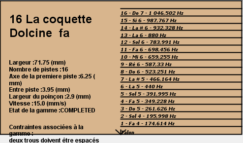
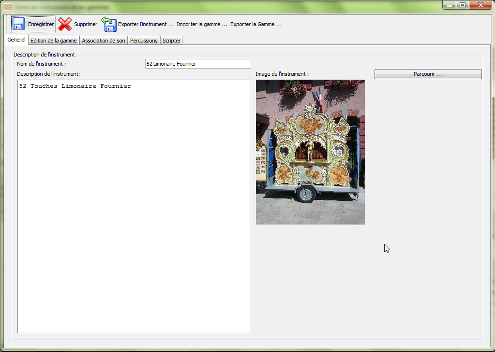
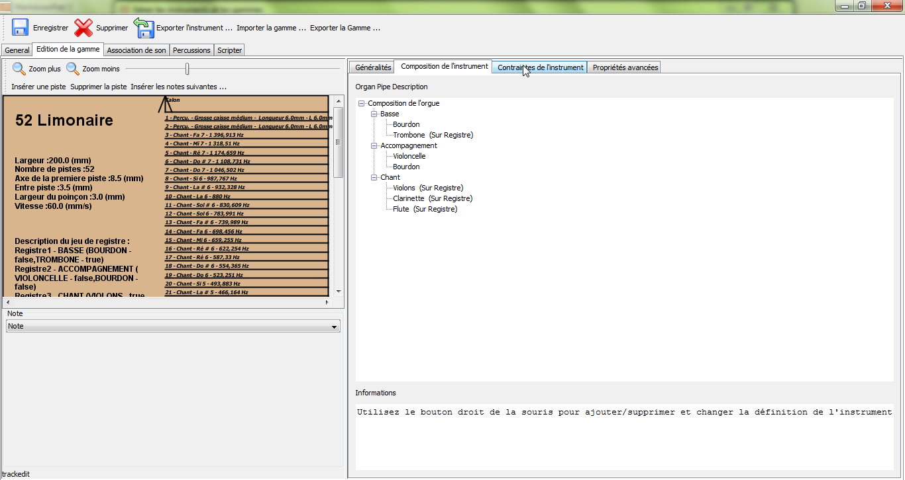
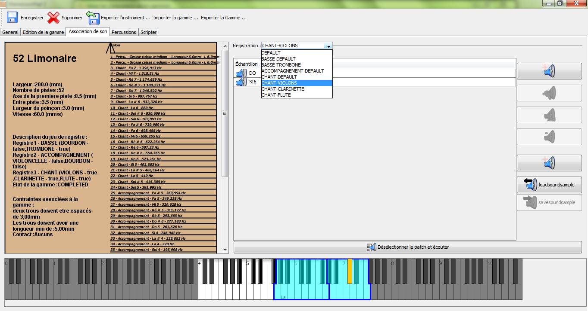
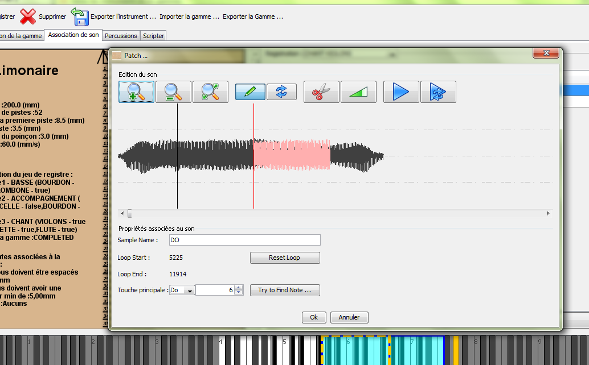
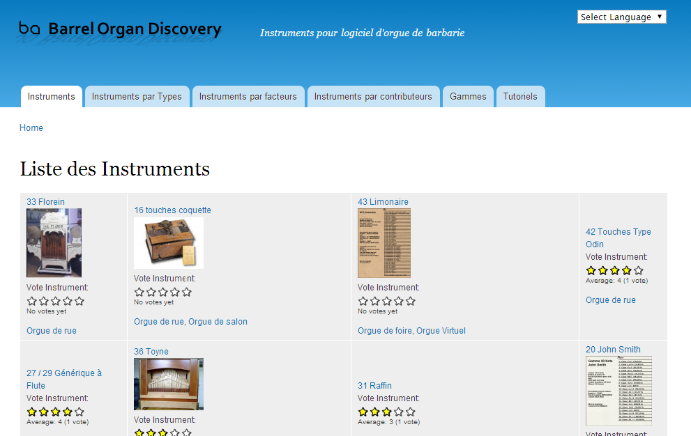
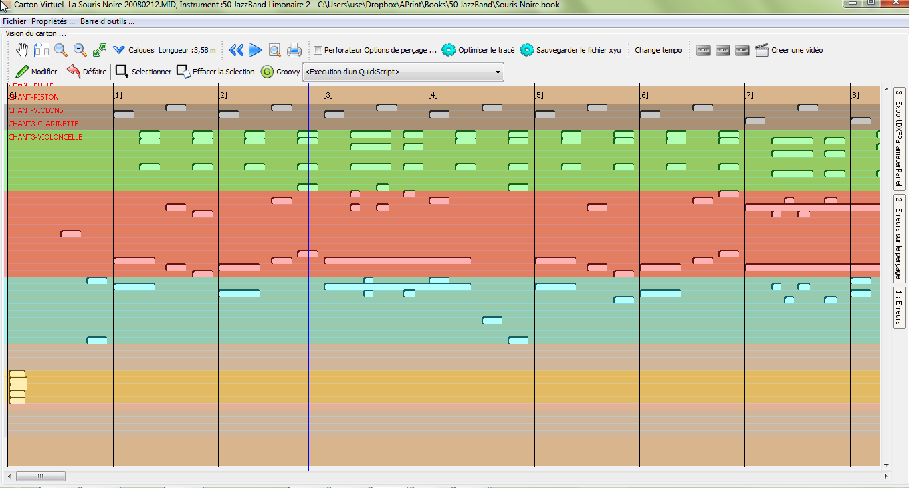

#Barrel Organ Discovery

*Patrice Freydiere - Avril/Novembre 2014*

Créé en 2005, barrel organ discovery est une organisation visant à faire découvrir les instruments mécaniques et faciliter la création d'oeuvres musicales pour ces instruments.

Depuis plus d'une dizaine d'années, l'utilisation d'internet et des ordinateurs a radicalement changé les possibilités de création pour les instruments mécaniques. à la fois dans la création d'oeuvres musicales, dans la facture d'instrument et la perforation.

Les heureux possesseurs d'instruments mécaniques, utilisent maintenant quotidiennement des ordinateurs pour communiquer, echanger et évaluer. 

Le format MIDI a beaucoup contribué à l'utilisation des ordinateurs dans la création musicale, l'automatisation des instruments mécaniques et les méthodes industrielles de découpe et de perforation de cartons.

##APrint Studio

Le premier outil mis à disposition par l'initiative (Barrel Organ Discovery) est **APrint**, puis par la suite APrint Studio. Cet outil initié dans les années 2000 avec des outils en ligne de commande, puis porté en Java dans les années 2004, vise à proposer des outils complémentaires à la création **Midi** pour mieux s'adapter à l'instrument et proposer des outils connexes à la création musicale (Perforation, Analyse, Comparaison).

###Vers une modélisation numérique des instruments

La première tache d'APrint Studio est de proposer une modélisation numérique des instruments. Cette modélisation (Gamme, Fonctionnement, Sons), permet de reproduire de plus en plus fidèlement l'instrument mécanique pour en tirer le meilleur.

Le premier élément de la modelisation d'un instrument, débute par la définition d'une gamme. la gamme définie la commande de lecture d'un instrument. Cette définition de gamme permet alors la création des cartes perforées. 

**Exemple de définition d'une gamme :**

La gamme contient :

1. la définition des notes et leur déclinaison en (Basses, accompagnement, chant)
2. la définition des percussions
3. la définition des commandes de registres

Nous avons donc dans un premier temps ancien, mis en place cette notion de gamme, qui nous a été très utile pour la perforation de cartons.

La gamme convient bien pour les petits instruments.

Dans notre réflexion, nous devions aller un cran plus loin pour permettre la diffusion de la connaissance de ces instruments. Dans les années 2008, la notion d'**instrument** a été mise en place dans le logiciel APrint Studio. Nous souhaitions permettre l'échange univoque des instruments, pour permettre la découverte ou un certaine standardisation de la définition des instruments, permettant l'échange des arrangements.

La définition d'un instrument, sauvegardé dans un fichier **.instrumentbundle** qui n'est ni plus ni moins qu'un fichier ZIP. Permet le transport Simple de toute la modélisation numérique d'un instrument :

1. la gamme
2. la composition d'un instrument (registres, jeux)
3. les échantillons sonores associés (notes, registres, percussions)
4. une photo, une description

Legend : Présentation générale de l'instrument

Gamme et composition de l'instrument. le panneau de droite décrit la composition des jeux de l'instrument

Un panneau permet la définition des échantillons sonores sur les notes, en fonction des registres.

Les sons peuvent être découpés, ajustés et retravaillés.

##Vers une mutualisation des définitions d'instruments

Le fichier de définition d'instrument étant auto suffisant, il est alors simple de l'échanger, le mettre à disposition d'autres utilisateurs. Ou conserver personnellement sur son propre ordinateur.

Un portail d'instrument, collaboratif a été mis en place sur le site web, pour permettre l'échange et la découverte des capacités des instruments.

à ce jour, 23 instruments sont proposés sur le site web, en téléchargement libre.

##Adaptation d'oeuvres musicales, et création de cartons

La définition des instruments est principalement utilisée pour la création musicale, APrint Studio permet un import de fichier MIDI, et leur écoute en correspondance avec la modélisation de l'instrument.

APrint studio se concentre sur les étapes finales de mise en carton. 

Le resultat de l'adaptation d'un fichier midi en carton, peut être sauvegardé dans un fichier TEXTE (au format XML), suffixé de l'extension **.book**.

Ce format de fichier permet un échange simplifié du resultat. Ce format est également pivot lorsque l'on demande à un professionnel de perçer le carton.

##Communiquer

Même si APrint Studio repose uniquemment sur des formats ouverts (Fichiers Texte,ZIP, WAV, ...), des exports sont également disponibles pour simplifier l'échange

###Export Midi

Le premier export proposé est le format Midi, il propose un export de l'ensemble des notes dans une piste midi. Dans le cas où l'on souhaite ajuster les export midi pour répartir les basses, ou les registres dans différentes piste, il est possible de le faire par script, en ayant accès à l'ensemble de la spécification MIDI.

###Export Video

Il est possible d'exporter en format video le jeu d'un carton. L'ouverture aux reseaux sociaux.

[https://www.youtube.com/watch?v=LUwVZ9qaVTk&list=PL028236D2E78B7C33](https://www.youtube.com/watch?v=LUwVZ9qaVTk&list=PL028236D2E78B7C33 "Exemples de videos sur YouTube")

###Export au format WAV, OGG (convertible en MP3)

Un format sonore, non midi pour écoute. Ce format permet une utilisation dans des baladeurs, sur des sites web. Le format MP3 n'étant pas libre et nécessitant des brevets et un cout d'utilisation, le format OGG a été utilisé. Le format Wav peut également être utilisé.

##Vers une commande de perforation

APrint studio permet l'export vers une commande de perforation, ceci peut être réalisé via un fichier midi. En fonction des machines utilisées pour la perforation, beaucoup de possibilités sont actuellement disponibles, mais pas forcement accessibles en standard actuellement. Nous avons travaillé sur les formats suivants :

- MIDI : toujours utilisé pour certains logiciels
- XYU : fichier texte décrivant par page les perforations a effectuer
- DXF : utilisé pour les machines lazer, prenant des fichiers DAO en entrée.
- G3 : suite de commandes G3 dans un fichier texte

D'autres format peuvent être simplement intégré, dans la mise en place cela peut se faire par un script ou un développement complémentaire à APrint Studio.

##Vers la numérisation d'oeuvres

APrint studio et ses extensions proposent un ensemble d'outillage pour numériser des oeuvres personnelles ou libres de droits.

Nous avons à ce jour :

- Un prototype de numérisation de carton à partir de photographies réalisées par un appareil photo
- Une extension bientot disponible en standard pour la numérisation de disques cartons.

#Logiciel Professionnel

Ce logiciel, bien que initialement tourné vers une utilisatiion grand publique, permet la construction par script ou par extension d'étendre ses fonctionnalités pour aider dans la création et la production de cartons d'orgues de barbarie.

##Recherche et développement

Nous essayons dans la démarche d'avancer sur certains besoins ou sujets associé à la création de cartons d'orgues de barbarie. Les avancées les plus intéressantes sont intégrée dans le projet principal pour une utilisation plus large. Nous travaillons à notre rythme sur  :

- la numérisation de cartons (traitement d'image, reconnaissance)
- la vérification d'un bon carton (motifs non perçable)
- l'extraction midi et transformation en carton.
