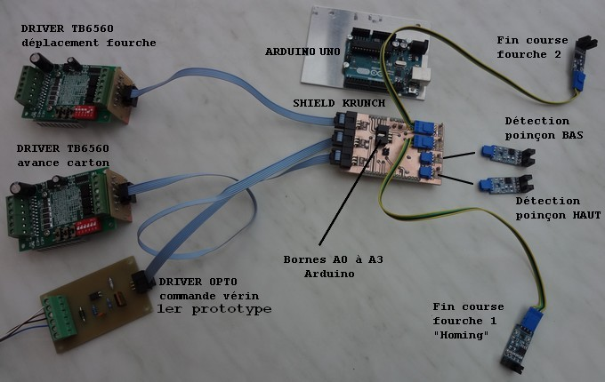
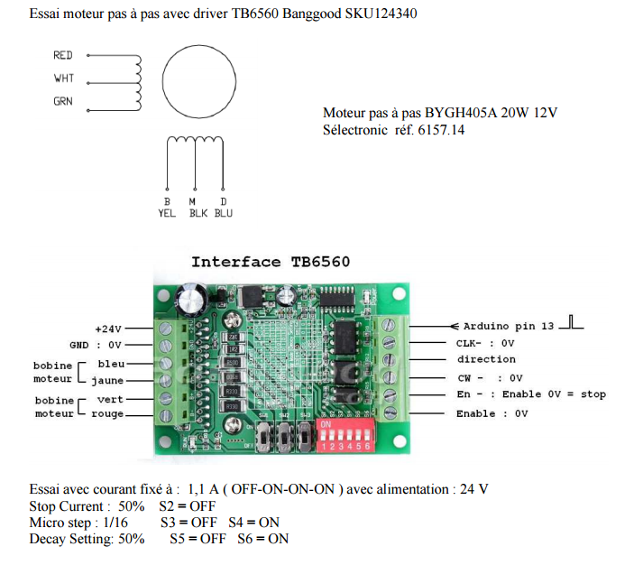

#Electronique

*Jean Pierre Rosset - 
Freddy Meyer - Patrice Freydiere - 2016*

##Eléments associés à l'électronique de pilotage de la machine

##Driver TB6560

Les drivers de moteur pas à pas sont les suivants :

Un ensemble de switchs est paramétré sur le driver pour définir les paramètres électriques, et de maintien.
La table de configuration des drivers est indiquée sur la platine électronique.

##Shield Krunch Arduino

à venir