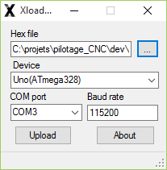
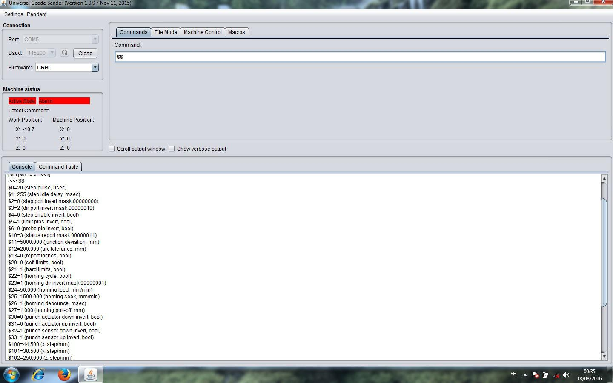
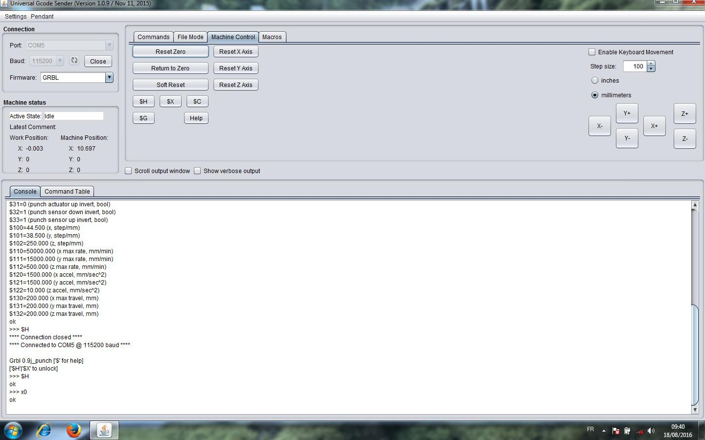

#Mode d’emploi Perforatrice pilotée par Arduino et APrint Studio

par Freddy Meyer

Je suppose que votre machine est construite selon les indications que vous trouverez à l’adresse : (schémas et platines électroniques) et il faut maintenant passer au plus intéressant…la faire fonctionner !
Pour ce faire, il vous faudra quelques programmes :
Selon la provenance de votre carte Arduino, il est possible que votre pc ne la reconnaisse pas. Il faudra juste installer un petit programme driver :

	CH 340 ou 341 *  
	ou installer l’environnement Arduino *

Les autres logiciels indispensables :

	X loader *
	Le fichier .hex *
	Universal Gcode Sender *
	Aprint 

* Disponibles sur la page

##Installation  préliminaire

En connectant la carte Arduino  sur la prise usb, vous devez entendre le son classique d’un branchement  périphérique sur usb et les leds doivent clignoter sur la carte. Si tel n’est pas le cas, il faudra charger Ch 340 ou l’environnement Arduino sur votre pc.

Chargez ensuite Xloader, l’installer et l’ouvrir

A côté de la fenêtre Hex file, cliquer sur les pointillés et sélectionner l’endroit où se trouve le petit fichier .hex
Dans Device, il faudra indiquer le type de votre Arduino
Dans Com port, on vous proposera peut-être plusieurs ports, sélectionner celui qui permettra à Arduino  d’interagir avec votre pc
Mettre Baud rate au maximum soit 115200
Cliquer sur Upload

Installer et ouvrir Universal Gcode sender
Ce programme vous permet de paramétrer votre machine : homing (zéro machine, bord de référence, vitesses des moteurs, capteurs…)

Cliquer sur le bouton « Open », sélectionner le port qui va bien.
Vérifier que Grbl soit bien marqué dans la fenêtre « Firmware »
Il faut maintenant rentrer les codes qui permettent à la machine de fonctionner.
Dans l’onglet «  Commands » on écrit $0 =20 puis cliquer sur « entrée » du clavier
$1=255 ….selon le listing de Jean – Pierre Rosset qui est disponible à l’adresse :  page du site

**A noter que nous n’êtes pas obligés d’écrire ce qui est entre parenthèses**

Selon vos capteurs poinçon haut et bas, il faudra peut-être modifier les lignes $ 32 et $ 33
Au lieu de $32=0, il faudra mettre : $32=1 (de même pour $33=1)
Je vais revenir sur les lignes $100 et $101 un peu plus bas
Ecrire maintenant $$ dans la fenêtre « Commands » et cliquer sur entrée. Le listing sera disponible et il serait bon de le vérifier et modifier au besoin en écrivant par exemple (dans la fenêtre « commands ») $27=1.000 et en validant toujours par « entrée ». La ligne corrigée sera ainsi prise en compte.

**Attention d’écrire tous les nombres avec des points et non des virgules. 1.000 et non 1,000**

Passons maintenant aux réglages des axes X et Y

Valider l’onglet **« Machine Control »** et cliquer sur le bouton **« $H »**. La perforatrice (qui doit être en marche) doit se positionner sur le point zéro, c’est à dire sur le capteur de Homing (origine machine)

Il faut maintenant s’occuper des réglages des déplacements X et Y. La précision de ces réglages est importante pour avoir les bons pas et la bonne vitesse de lecture de votre carton perforé.

Il s’agit d’adapter les lignes $ 100 et $ 101

Si les drivers TB 6560 sont réglés pour travailler en 16ème de pas, il faudra doubler les valeurs par rapport aux 8ème de pas.

Ces valeurs sont également en fonction du diamètre du rouleau d’entraînement du carton et le diamètre des roues dentées de la courroie.
Mes valeurs pour du 16ème de pas (lignes à écrire ou à modifier dans « Commands ») 

	$100 = 44.500
	$101 = 38.500

Commençons par l’axe X (ligne $100)

Mettre la machine sur **« homing »** avec $H
Sur la page **« Machine Control »** taper par exemple 100 dans la fenêtre **« Step Size »**

Si vous avez vérifié que les dimensions sont bien en mm et non en inchs, votre col de cygne devrait se déplacer de 100 mm en cliquant sur X+ et X-

Pour cette vérification, je conseille de mesurer avec une réglette depuis un point fixe de la machine vers un point du col de cygne.

Ajuster la ligne $100 jusqu’au résultat satisfaisant en n’oubliant pas de revenir à chaque fois au homing avec $H 

Insérer maintenant un carton et répéter l’opération pour l’axe Y en faisant des repères sur le carton et en mesurant ensuite la justesse du déplacement. Ici ce sont les commandes Y+ et Y- 
Ajuster les valeurs sur la ligne $101
On peut en profiter pour régler le bord de référence en indiquant au programme le nombre de pas nécessaires pour aller du homing au bord de référence. Le poinçon doit être à moitié sur ce bord de référence.

On revient sur la page précédente par le bouton **«  Commands »** et on tape : G10 L2 P1 X 12 

On valide toujours par **« entrée »**

La valeur X12 (valable pour ma machine) doit être adaptée à votre perforatrice et est fonction de la distance qui sépare le homing de votre bord de référence.

Vous serez peut-être tenu d’écrire (ex.) G10 L2 P1 X 14.5

Toujours dans la fenêtre **« Commands »** il faudra taper X0 (zéro) et **« entrée »** pour que la machine se déplace depuis le homing sur le bord de référence.

Ajuster la valeur X pour avoir le résultat escompté sans oublier qu’il faut toujours revenir sur homing par $H avant de retaper X0

Dans la même fenêtre **« Commands »** vous pouvez aussi écrire M100 >entrée pour déclencher un coup de poinçon. 

Votre machine est maintenant prête à  perforer les 1ers trous. 
Pour ceci nous utilisons le programme Aprint