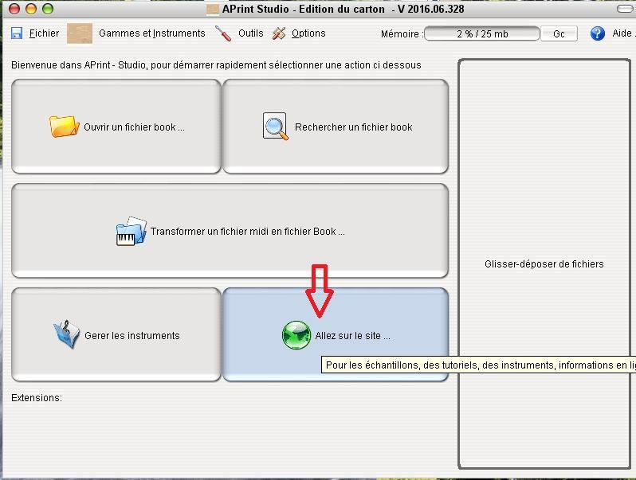
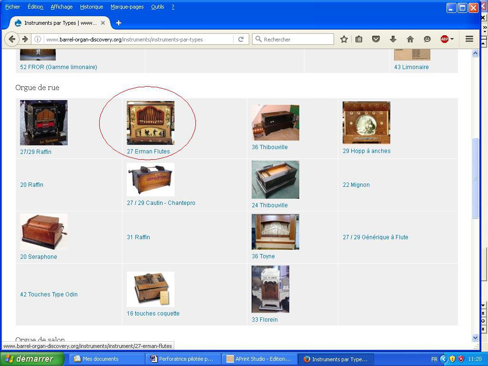
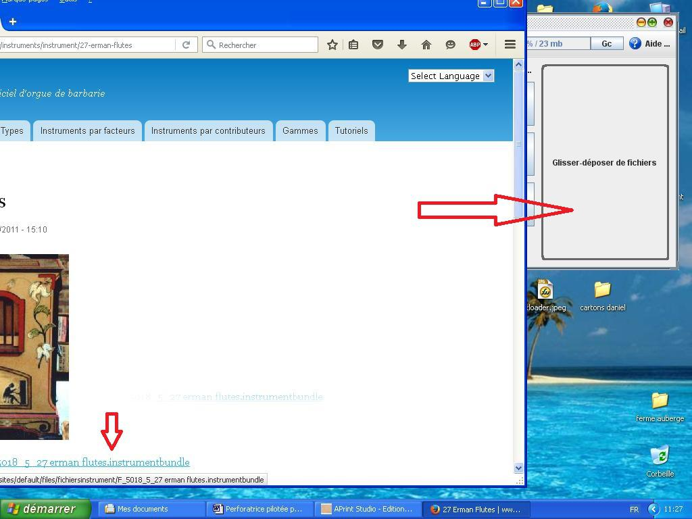
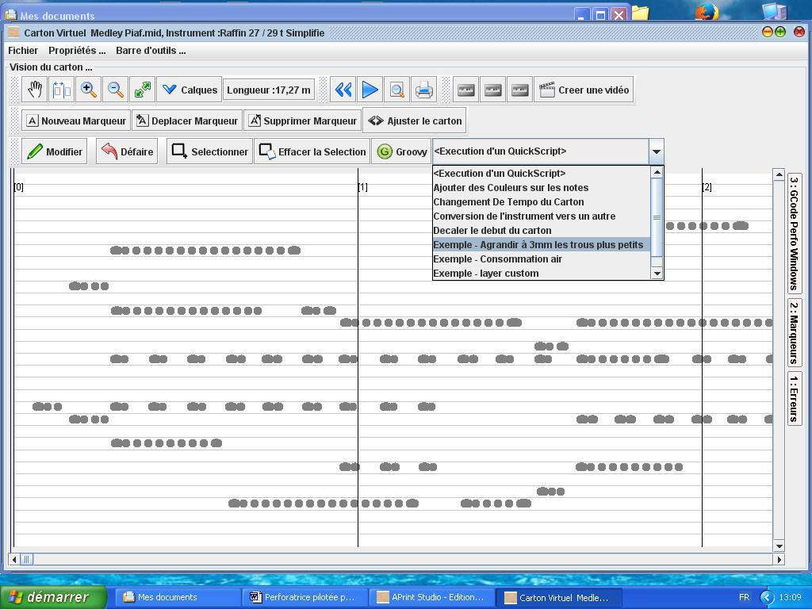
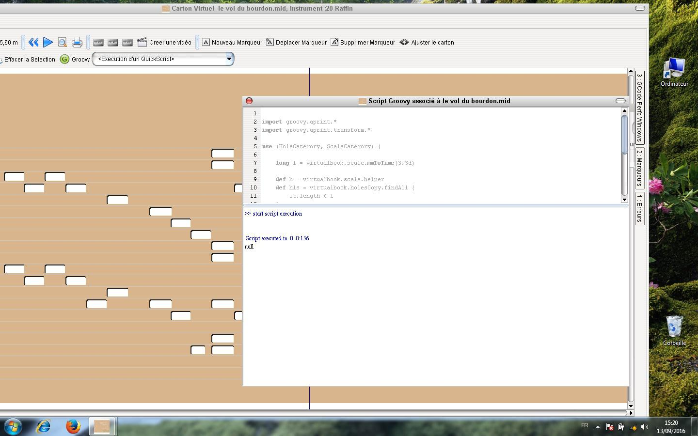
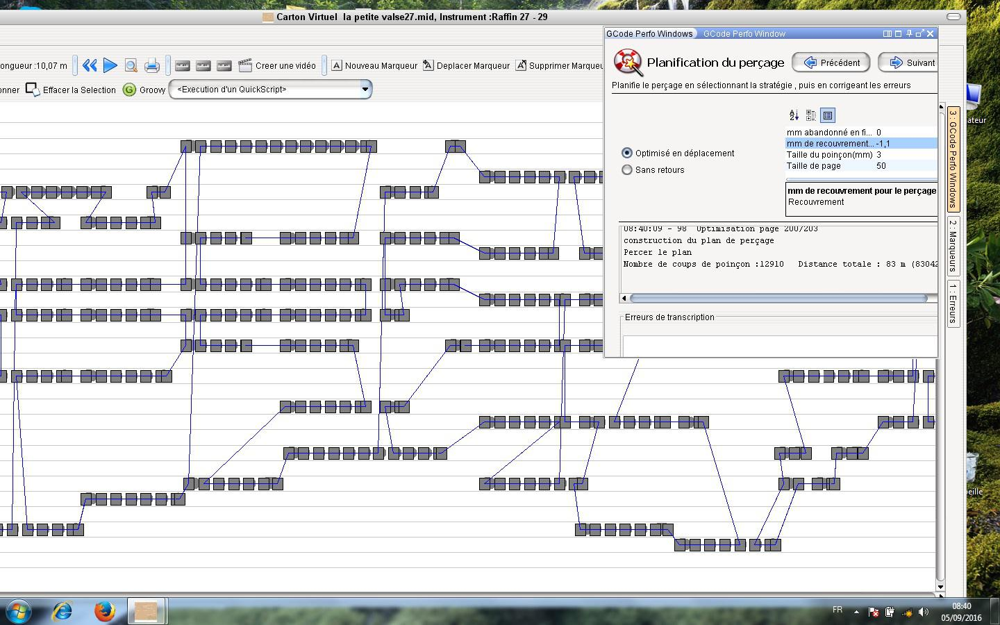
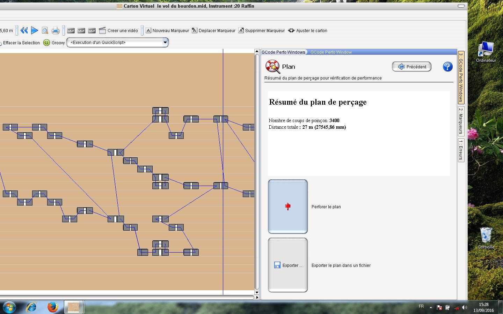
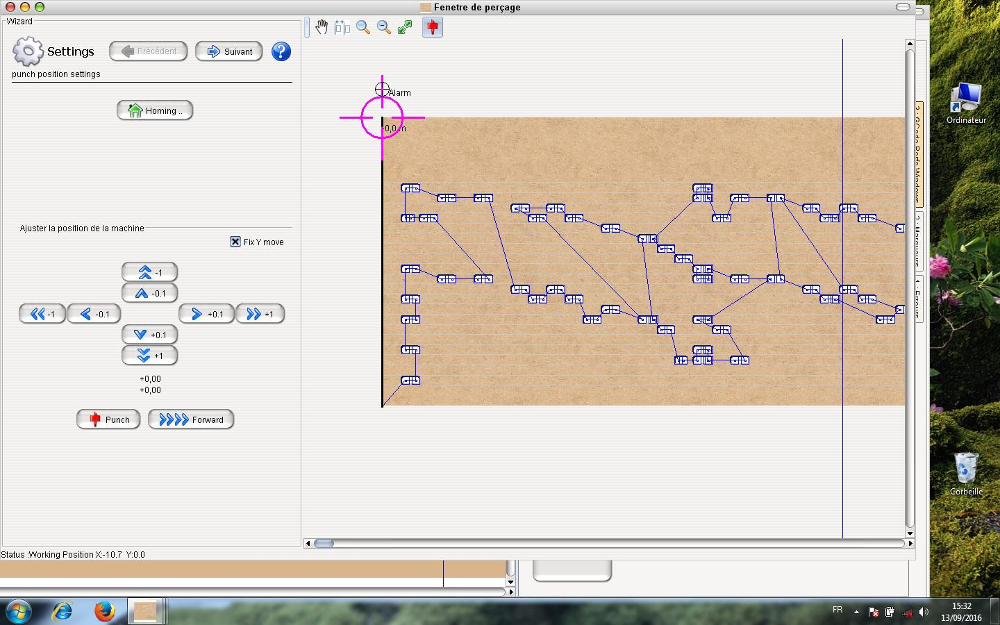
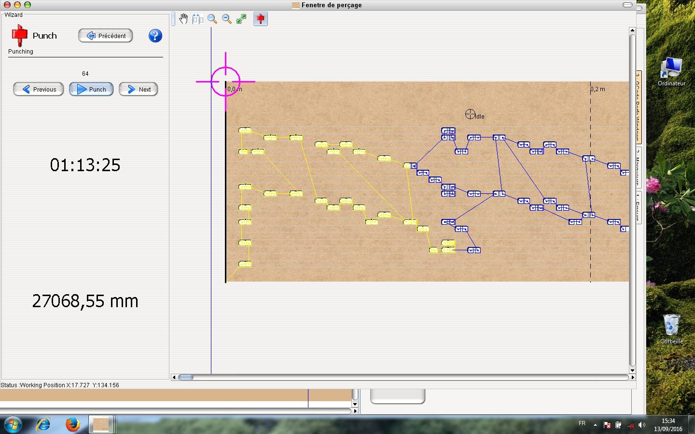

# Utilisation APrint Studio pour le perçage

par Freddy Meyer

**APrint Studio** transforme, en quelques clics,  les fichiers **midi** en **Gcode** (code utilisé dans les machines industrielles à commande numérique), gage d’une très bonne précision même à grande vitesse.

APrint s’occupe de tous les paramètres de votre orgue (téléchargeable depuis une bibliothèque) avec toutes les subtilités que je vais vous expliquer pour une utilisation des plus aisées.

Ouvrir APrint et importer un instrument

Avant toute chose, il faudra importer l’instrument pour lequel vous voulez perforer le carton. Vous aurez ainsi tous les paramètres (nombres de touches, pas, mesure depuis le bord de référence…)
Je vais prendre l’exemple d’un 27 touches pneumatique.
A l’ouverture de APrint, cliquer sur le bouton « Aller sur le site »

En clickant sur "Instruments", une nouvelle fenêtre va s'ouvrir. Il faudra valider "Instruments par type" et choisir son orgue sur la page.

Un clic gauche sur l’instrument fera apparaître une adresse

Clic gauche maintenu, glisser simplement cette adresse dans la fenêtre « glisser – déposer des fichiers » dans la fenêtre d’APrint. Il faudra bien sûr s’arranger pour que les deux pages soient visibles. Au bout de quelques instants vous aurez l’indication  « instrument importé avec succès ».

Il faut maintenant importer un fichier midi arrangé pour votre orgue. Là encore, Il suffit de glisser le fichier midi à perforer dans la fenêtre « glisser - déposer des fichiers » Dès que le fichier est importé, une fenêtre vous demandant de sélectionner votre orgue va apparaître. Si vous avez importé plusieurs orgues, il suffit de cliquer sur les orgues adjacents jusqu’à apparition de celui qui vous intéresse.

Cliquer sur **«Afficher le carton»**

Après un rapide calcul, vous aurez la visualisation du carton. Ici, j’en profite pour dire que les notes plus petites que la taille du poinçon ne seront pas perforées. Ceci n’est bien sûr pas envisageable. Si ces notes y sont, c’est qu’elles ont une raison d’être.
Alors comment résoudre ce problème ? Rien de plus simple ! 

Dans la fenêtre « Quickscript », il faudra cliquer sur **«agrandir à 3 mm les trous plus petits»**

Une vérification est néanmoins proposée dans le logiciel. Il vous proposera d'agrandir les trous trop petits à la taille du poiçon. 

Je vous laisse découvrir les autres fonctionnalités et les divers onglets de cette page. 

Une nouvelle fenêtre va s’ouvrir et qui confirmera que les trous ont été agrandis

A noter que « agrandir à 3 mm » n’est qu’une
indication de fonction. Si vous avez  un poinçon de 3,3 ou 4 mm  (à définir dans le tableau suivant) les trous seront calculés selon
ces dimensions.

On peut fermer cette fenêtre et cliquer ensuite sur le bouton **«Gcode perfo windows»**
Là, plusieurs options sont à votre disposition
En cochant **«Optimisé en déplacement»**, le carton va faire des allers – retours, ce qui diminue considérablement le temps de poinçonnage.

Le bouton « sans retours » ne fait qu’avancer le carton. Cette option est utilisée pour les papiers perforés qui se plieraient lors du retour.

Mm abandonné permet de ne pas perforer une fin de note. En gros, si une note fait 6,1 mm, on pourrait ne perforer que 6 mm. Mettre la valeur 0

Mm de recouvrement permet de faire revenir le poinçon légèrement en arrière pour être sûr que le trou soit bien propre. Cette fonction est surtout utile pour les poinçons carrés et les cartons pour lecture mécanique.

A l’inverse, pour du papier ou du carton pour pneumatique, il est conseillé de faire des ponts entre chaque trou. Il faudra donc donner les valeurs suivantes **«  - 1 »** ou  **« - 1,1 »**. On aura ainsi un pont de 1 ou 1,1 mm.

Taille du poinçon sera la dimension de votre poinçon 
Taille de page est en mm et détermine le retour effectué lors de la perforation. En mettant par exemple 50, le carton reculera de 50 mm pour permettre l’optimisation.

Une fois ces valeurs rentrées, il faudra cliquer sur **«enter ou entrée»** du clavier et le calcul se lancera automatiquement. A noter qu’à chaque changement d’une des valeurs, il faudra revalider par **«enter»**. Le fichier midi est ainsi transformé en Gcode. On aura également le nombre de coups de poinçons ainsi que la distance parcourue par ce même poinçon.

Cette opération terminée, on clique sur suivant. La page suivante s’ouvre.
Un petit rappel du nombre de coups de poinçons et la distance parcourue. 
Ne reste plus qu’à valider **«perforer le plan»** ou **«exporter le plan dans un fichier»** pour une utilisation ultérieure par la fonction **«ouvrir un fichier book»** que l’on trouvera à l’ouverture d’APrint.

On arrive maintenant sur la page de perforation où l’on cliquera sur le bouton « homing » pour positionner la machine sur le point zéro (référence machine).
Je conseille de perforer un morceau d’essai afin de vérifier si l’axe du premier trou correspond bien aux dimensions nécessaires à votre orgue. Au besoin, on peut corriger avec les boutons **«ajuster la position de la machine»**.

Le bouton **«forward»** permet de faire avancer le carton soit pour créer une amorce ou pour le sortir de la machine sans avoir à enlever les rouleaux presseurs.

La fenêtre de droite donne un aperçu du carton et des déplacements du poinçon.
La cible en rouge est le point de départ (le bord de référence carton) d’où partent les perforations. 
Comme je pense que vous êtes pressés de voir la perforatrice en œuvre, je vous invite à cliquer sur le bouton **«suivant»** dans la fenêtre **«Settings»**

La dernière fenêtre vous invitera à cliquer sur **«punch (perforation)»**
Les trous perforés s’affichent en jaune. On peut ainsi voir le chemin parcouru.

Les boutons **«previous et next»** permettent de reprendre une perforation.

Certaines fenêtres peuvent différer en fonction de l’évolution du logiciel.

Lesréglages ci dessus restent valables pour les versions plus anciennesd’Aprint mais comme ce logiciel évolue, quelques fonctionnalitésont été rajoutées et d’autres ont été simplifiées. Je ne peuxque vous conseiller de remplacer votre ancienne version.

Ily a ainsi possibilité d’agrandir plus rapidement les trous troppetits 

Onpeut commander un moteur pas à pas pour la perforation en lieu etplace du moteur de visseuse, d’un électroaimant ou d’un vérinpneumatique.

Onpeut se passer du capteur de poinçon bas ...

Dansle cas d’une utilisation de moteur pas à pas, sur Universal Gcodesender, modifiez la ligne $29 selon vos besoins. Il faudra bien sûrcharger le nouveau fichier .hex pour avoir ces options.

$29= 0  si vous avez un capteur poinçon haut et un autre poinçon bas

$29= 1  dans le cas où vous n’avez qu’un capteur poinçon haut

$29= 10 si vous voulez piloter un moteur pas à pas pour la perforation.

Il faudra aussi paramétrer $40 et \$41.

Pour avoir la vitesse maximale lors de la perforation, il est conseilléde régler le driver de ce moteur au pas de 1 (switchs sur laplatine)

Pour les lignes $40 et \$41, il faudra ajuster selon votre machine en sachant que plus le nombre sera petit, plus grande sera la vitesse mais que le moteur va décrocher à un moment donné.

Exemple :

$40= 200 (dans le cas de pas entiers). Modifiez cette valeur pour avoir la vitesse maximale tout en conservant le couple optimal. A un moment donné, le moteur va grogner ou ne plus avoir assez de puissance pour transpercer le carton.

$41=1  Egalement à régler selon votre perforatrice 

Mes réglages à titre indicatif : \$40 = 185   et $41 = 0.8

### APrint	

Il faudra toujours appliquer la procédure comme expliqué plus haut pour arriver à la page où l’on pourra sélectionner ou vérifier
le port com qui permet au logiciel de communiquer avec la machine.

@@@@