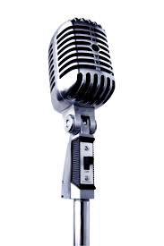

  
    

#Notes sur l'enregistrement d'instruments dans le logiciel

__Novembre 2011__

##Introduction

Une des forces du logiciel est l'utilisation d'enregistrements d'instruments r&eacute;els. Le r&eacute;alisme de la restitution sonore, est tr&egrave;s utile pour donner une id&eacute;e d'un arrangement de morceaux de musique sur un instrument.

Les logiciels APrint et APrint Studio utilisent des &eacute;chantillons des tuyaux et des hanches et les restituent pour chaque jeu de notes. 

Cette technique permet d'avoir une bonne premi&egrave;re approche finale, avec un enregistrement simple.

Dans les diff&eacute;rents enregistrements que nous avons pu effectuer, nous avons enregistr&eacute; des tuyaux sur les instruments eux-m&ecirc;mes (sans d&eacute;montage). Ceci permet de conserver certains aspects du jeu de l'instrument comme par exemple : certaines harmonies, certains bruits caract&eacute;ristiques ainsi que la restitution sonore dans l'espace. 

Par exp&eacute;rience, nous avons remarqu&eacute; que l'enregistrement sonore demande certaines pr&eacute;cautions sur les m&eacute;thodes d'&eacute;chantillonnage, de prise de son, et de choix des sons. 

Cet article a pour but de proposer une premi&egrave;re approche sur l'enregistrement. Loin d'&ecirc;tre exhaustif, il sera enrichit avec les retours d'exp&eacute;riences et des comp&eacute;tences des diff&eacute;rents utilisateurs. 

Nous proposons ici une d&eacute;marche sur les quelques enregistrements r&eacute;alis&eacute;s.

Dans cette d&eacute;marche, nous avons essay&eacute;s de limiter au maximum tous les biais num&eacute;riques, en essayant de pr&eacute;server au maximum les caract&eacute;ristiques sonores de l'instrument.

##1 - Etapes d'enregistrement sonores

Trois &eacute;tapes minimum sont n&eacute;cessaires pour la cr&eacute;ation d'un nouvel instrument :

<ul>
      
<li>D&eacute;finition de la gamme de l'instrument et cr&eacute;ation d'un carton de gamme</li>
      
<li>Enregistrement des sons de la gamme et des registres</li>
      
<li>Cr&eacute;ation de l'instrument dans le logiciel et am&eacute;lioration de la restitution </li>
    
</ul>
##2 - D&eacute;finition de la gamme de l'instrument et cr&eacute;ation du carton de gamme &agrave; enregistrer

Une premi&egrave;re &eacute;tape consiste &agrave; cr&eacute;er un carton contenant la gamme de l'instrument. Ce carton de gamme sera ensuite jou&eacute; par l'instrument et enregistr&eacute; note &agrave; note et registre par registre. 

 

Pour cr&eacute;er le carton de gamme, la d&eacute;finition de l'instrument (fichier de gamme ou fichier .scale) doit &ecirc;tre r&eacute;alis&eacute;.Cette d&eacute;finition peut &ecirc;tre faite dans le logiciel en utilisant l'&eacute;diteur de gamme.

Si l'orgue partage une gamme d'un autre instrument existant ou r&eacute;cup&eacute;r&eacute;, il est possible de reprendre celle-ci sans avoir &agrave; la red&eacute;finir. On utilise alors la fonction d'export de l'&eacute;diteur d'instrument.

 

La description de la gamme permet de connaitre les notes &agrave; enregistrer ainsi que les diff&eacute;rents registres de l'instrument. Les registres sont importants car le carton de gamme doit pouvoir jouer les diff&eacute;rents sons des registres pour une meilleure restitution.

Une fois la gamme d&eacute;finie ou r&eacute;cup&eacute;rer, un scripts permettent de g&eacute;n&eacute;rer un carton de gamme directement. Le script prends en compte un jeu long du tuyau ainsi que des r&eacute;p&eacute;titions successives pour voir le comportement sonore dans l'attaque et la fin du jeu.

Les percussions sont &eacute;galement &agrave; enregistrer. (la gamme de test prend &eacute;galement en compte les registres et l'enregistrement de ceux ci unitairement).

 

La d&eacute;finition de la gamme &agrave; enregistrer est clef dans le processus, et plusieurs points d'attention sont &agrave; consid&eacute;rer :

<ul>
      
<li>Un enregistrement de quelques secondes doit &ecirc;tre pr&eacute;vu pour chaque note. Ce long enregistrement de chaque note, permet d'&eacute;viter un travail de boucle sur l'&eacute;chantillon et introduire un biais num&eacute;rique. </li>
      
<li>Une r&eacute;p&eacute;tition de chaque note est &eacute;galement &agrave; enregistrer, ceci permet de mieux rep&eacute;rer dans la partie sonore l'attaque et les temps de d&eacute;but et de fin du son par rapport &agrave; la commande m&eacute;canique.</li>
      
<li>Les percussions sont &eacute;galement &agrave; enregistrer</li>
    
</ul>
##3 - Pr&eacute;paration de l'enregistrement sonore

Nous avons proc&eacute;d&eacute; ainsi dans nos enregistrements :

<h3>Mettre l'instrument dans un lieu neutre et silencieux</h3>

Le lieu doit &ecirc;tre au maximum neutre dans le sens o&ugrave; les effets de r&eacute;verb&eacute;ration doivent &ecirc;tre limit&eacute;s (sauf si la restitution doit refl&eacute;ter &eacute;galement cette r&eacute;verb&eacute;ration naturelle). 

Il est souhaitable d'&eacute;viter les &eacute;glises ou des locaux vides, qui comportent des murs renvoyant le son &agrave; de multiples reprises. Dans le cas o&ugrave; une r&eacute;verb&eacute;ration est souhait&eacute;e, celle ci peut &ecirc;tre ajout&eacute;e &agrave; post&eacute;riori par le logiciel.

Les lieux ext&eacute;rieurs peuvent &eacute;galement &ecirc;tre utilis&eacute;s, mais ceux ci posent des probl&egrave;mes de souffles dans les micros s'il y a du vent. (&agrave; cet effet, certains micros sont &eacute;quip&eacute;s d'accessoires ou de mousses permettant la prise de son en ext&eacute;rieur).

<h3>Essayez de r&eacute;duire les sons parasites</h3>

Certains sons comme la soufflerie, ou des bruits m&eacute;caniques peuvent &ecirc;tre enregistr&eacute;s dans le cas d'instruments simples, par contre, si ces bruits sont enregistr&eacute;s sur chaque prise de note, lors de la restitution d'un carton, plusieurs notes &eacute;tant jou&eacute;es en m&ecirc;me temps, ces sons vont se cumuler dans la restitution. Ces effets deviennent g&ecirc;nant sur les gros instruments avec beaucoup de registres.

Il peut &ecirc;tre propos&eacute; de r&eacute;duire l'importance des ces bruits si ceux ci sont pr&eacute;pond&eacute;rants, par exemple en camouflant la soufflerie ou essayant un meilleur micro (pour le bruit d'enregistrement).

Un retour d'exp&eacute;rience serai appr&eacute;ci&eacute; sur des conditions diff&eacute;rentes de num&eacute;risation.

##3 - Num&eacute;risation des sons

Pour num&eacute;riser les sons de l'instrument, plusieurs mat&eacute;riels doivent &ecirc;tre consid&eacute;r&eacute;s :

<ul>
      
<li>Le Microphone</li>
      
<li>L'enregistreur num&eacute;rique</li>
    
</ul>
<h4>Le Microphone</h4>

Le microphone doit &ecirc;tre de bonne qualit&eacute;, plusieurs technologies de micro peuvent &ecirc;tre utilis&eacute;es en fonction du r&eacute;sultat souhait&eacute;s. (omnidirectionnel, directionnels ... &agrave; bobine ou &eacute;lectrostatiques). (http://fr.wikipedia.org/wiki/Microphone)

La position du micro est tr&egrave;s importante pour l'enregistrement, celui ci doit &ecirc;tre positionn&eacute; en frontal et &agrave; bonne distance de l'instrument, afin de pouvoir capturer les diff&eacute;rents tuyaux et leur r&eacute;partition dans l'espace.

En gardant une "position fixe" du microphone durant l'enregistrement, celan permet de garantir une prise de son uniforme sur l'ensemble des &eacute;l&eacute;ments enregistr&eacute;s.

Pierre Penard sur son site propose un petit montage &eacute;lectronique pour utiliser deux &eacute;lectrets, et qui effectue une moyenne et une balance de prise de son de chaque cot&eacute; de l'instrument. (http://orgue-de-barbarie.pagesperso-orange.fr/bidouille.htm)

Un micro r&eacute;cent capture &eacute;galement beaucoup mieux les fr&eacute;quences par rapport &agrave; un micro ayant quelques ann&eacute;es.
Penser &eacute;galement &agrave; la bande passante du micro, en effet certains micros d&eacute;di&eacute;s &agrave; la voix vont att&eacute;nuer les basses, pourtant tr&egrave;s importantes dans l'enregistrement d'un orgue de foire.
La prise de son est quelque chose de complexe, et &eacute;galement fonction du niveau de qualit&eacute; souhait&eacute; dans l'enregistrement. Plus il est souhait&eacute; une grande fid&eacute;lit&eacute;, plus la mise en oeuvre sera d&eacute;licate.

      
<b>En retour d'exp&eacute;rience, lors de l'enregistrement, il est n&eacute;cessaire que le micro une fois positionn&eacute; ne soit plus d&eacute;plac&eacute; pour l'ensemble des &eacute;chantillons. En effet le d&eacute;placement du micro en cours de route ne refl&egrave;tera plus la balance sonore naturelle de l'instrument et des diff&eacute;rents les volumes des tuyaux d'origine. Si le micro est d&eacute;plac&eacute;, cela peut donner des r&eacute;sultats hasardeux.</b>
    

<h4>L'enregistreur num&eacute;rique</h4>

Pr&eacute;f&eacute;rer un enregistreur num&eacute;rique portatif &agrave; un ordinateur. En effet l'enregistreur num&eacute;rique ne fait pas de bruits additionnel (contrairement &agrave; la ventilation d'un ordinateur). L'ordinateur, ayant des hautes fr&eacute;quences parasite &eacute;galement la prise de son, introduisant des frequences non souhait&eacute;es dans l'enregistrement.

Utilisez si possible un format d'enregistrement sans perte (WAV, ou brut), les formats d'enregistrement type MP3 par exemple, introduisent des modifications dans l'&eacute;chantillon et perdent certains signaux (filtrage fr&eacute;quentiel). Le format MP3 impose egalement un transformation informatique au format WAV pour &ecirc;tre utilis&eacute; dans le logiciel (limitons les transformations informatique si possible)

Utilisez un &eacute;chantillonnage &agrave; 44Khz de fr&eacute;quence, cette fr&eacute;quence d'&eacute;chantillonnage est celle utilis&eacute;e par les CD, et pr&eacute;sente une bonne qualit&eacute; audio. Cette vitesse d'&eacute;chantillonage induit &eacute;galement de de gros volumes de fichiers de sortie, donc pr&eacute;voyez la place n&eacute;cessaire sur l'enregistreur num&eacute;rique.(Dans un soucis d'optimiser la taille des &eacute;chantillons cr&eacute;&eacute;s, r&eacute;alisez un &eacute;chantillonage en MONO)

En retour d'exp&eacute;rience, enregistrez un minimum de 3 &agrave; 4 secondes par note. Cela vous sera utile lors de l'op&eacute;ration de "mapping". Lavitesse moyenne de d&eacute;filement du carton &eacute;tant de 6cm/seconde, vous obtiendrez la possibilit&eacute; de jouer la note sur 18 &agrave; 24 cm sans avoir &agrave; r&eacute;aliser de "boucle num&eacute;rique" sur le son. Cette op&eacute;ration de "boucle" &eacute;tant assez fastidieuse &agrave; r&eacute;aliser. Proc&eacute;dez par ordre et m&eacute;thode. Nommez et enregistrez vos &eacute;chantillons de fa&ccedil;on &agrave; pouvoir les identifier plus facilement. Cr&eacute;ez des r&eacute;pertoires au nom des &eacute;l&eacute;ments enregistr&eacute;s (ex: Accompagnement, Piccolos - contrechant, Trombones-basses, ...) et placez vos &eacute;chantillons en les nommant, par exemple, comme ceci : "num&eacute;ros de piste dans la gamme - nom de la note" (ex:"31-LA.wav", "32-SI.wav", "38-FAdiese.wav", ...) Cette m&eacute;thode vous facilitera l'&eacute;tape du "mapping".

<h4>R&eacute;cup&eacute;ration des &eacute;chantillons et premiers traitements</h4>

Une fois l'enregistrement de la gamme et des diff&eacute;rents registres ont &eacute;t&eacute; r&eacute;alis&eacute; avec l'enregistreur num&eacute;rique, les sons doivent &ecirc;tre rep&eacute;r&eacute;s et d&eacute;coup&eacute;s (dans le gros fichier .WAV d'enregistrement)

<b>Pr&eacute;servez les attaques des tuyaux dans le d&eacute;coupage, c'est extr&ecirc;mement important pour le caract&egrave;re de l'instrument. Chaque instrument est diff&eacute;rent et une de ses caract&eacute;ristique d'&eacute;coute est cette phase transitoire du tuyau avant l'instauration du r&eacute;gime permanent</b>.

 Pr&eacute;servez l'attaque des tuyaux (ou anches) 

Pour une meilleure restitution vous pouvez &eacute;galement regarder et pr&eacute;server les in&eacute;galit&eacute;s de temps d'attaque des notes , (ex : les basse par exemple mettent plus de temps &agrave; r&eacute;agir que les flutes du chant). Ce delta peut &ecirc;tre mesur&eacute; dans l'enregistrement de notes courtes &agrave; la fin de l'enregistrement de la note longue.

Retour d'exp&eacute;rience : Ne retravaillez pas num&eacute;riquement les &eacute;chantillons. La suppression du bruit par analyse de zones non bruit&eacute;es d&eacute;t&eacute;riore l'enregistrement. Pr&eacute;f&eacute;rez un bon enregistrement audio avec un bon micro &agrave; un retraitement num&eacute;rique &agrave; post&eacute;riori. Un traitement num&eacute;rique peut &ecirc;tre r&eacute;alis&eacute;, mais en tr&egrave;s bonne connaissance du sujet, (les r&eacute;ponses fr&eacute;quentielles des micros, des fr&eacute;quences de l'instrument ... etc).

Evitez les r&eacute;ductions ou augmentation de volumes, cela d&eacute;truit l'&eacute;quilibrage souhait&eacute; de l'instrument par les facteurs d'orgue. On peut abusivement augmenter le volume des basses sur un ordinateur n'ayant pas de bons "hauts parleurs" (speakers) et rendant une bonne restitution, cependant si l'on &eacute;coute l'instrument sur de bons speakers le r&eacute;sultat est d&eacute;sastreux.

##4 - Construction et r&eacute;partition des sons sur l'instrument

Une fois les sons r&eacute;cup&eacute;r&eacute;s et enregistr&eacute;s, il reste une phase importante dans la construction sonore de l'instrument : le "mapping".

Le "mapping" consiste &agrave; attribuer un son &agrave; une ou plusieurs notes de l'instrument, quelques guides ci dessous permettront de tirer au mieux de l'&eacute;chantillonnage r&eacute;alis&eacute;:

<ul>
      
<li>Mapper les sons dans les m&ecirc;mes sections de registres, autrement dit : ne prenez pas une note du chant pour la mettre sur une note de l'accompagnement. Connaissez la facture de votre instrument et regardez bien les diff&eacute;rents types de tuyaux pour prendre les sons ad&eacute;quats.</li>
      
<li>Choisissez dans les sons d'une section de registre, un ou plusieurs sons bien enregistr&eacute;s. Il arrive que certains tuyau ne soient pas bien accord&eacute;s ou r&eacute;agissent diff&eacute;remment de leur voisins. Cela peut &ecirc;tre souhaitable pour la bonne conformit&eacute; de restitution.  Si un tyau est "particulier" et que vous souhaitez garder ce comportement, enregistrez alors les tuyau voisins). Si vous utilisez ce son sur plusieurs tuyaux, vous g&eacute;n&eacute;ralisez alors ce caract&egrave;re particulier, donc vous changez l'identit&eacute; de l'instrument. 
</li>
      
<li>N'associez pas une plage trop grande de notes pour un son, multipliez les sons. En retour d'exp&eacute;rience, ne d&eacute;passez pas 3 notes d'&eacute;cart par rapport &agrave; la note du son, plus le son est utilis&eacute; sur les notes "lointaine" de la note de base du son, plus le son est d&eacute;form&eacute; par r&eacute;&eacute;chantillonage par le logiciel. Par exemple, pour mapper les notes "do, re, mi, fa, sol, la" nous s&eacute;lectionnerons l'&eacute;chantillon RE pour mapper "do, re, mi" et l'&eacute;chantillon SOL pour "fa, sol, la".</li>
      
<li>Multipliez les &eacute;chantillons dans la partie haute de l'instrument, en effet les sons aigu&euml;s on des fr&eacute;quences beaucoup plus &eacute;lev&eacute;es et c'est sur cette plage que la d&eacute;formation s'entends malheureusement le plus. C'est dans cette plage que les op&eacute;ration math&eacute;matiques op&eacute;r&eacute;es sur des &eacute;chantillons manquant, divergent pas rapport &agrave; l'instrument.</li>
    
</ul>

Bref, la partie mapping est une partie d&eacute;licate de la cr&eacute;ation de l'instrument. Plusieurs essais sont &agrave; r&eacute;aliser, sur des cartons diff&eacute;rents. L'&eacute;coute unitaire peut ne rien donner, mais sur un carton de musique, on reconna&icirc;t mieux l'instrument.

Pr&eacute;voyez un peu de temps pour cette &eacute;tape.

##En Synth&egrave;se

Parce que l'important, c'est l'instrument,  

Soyez propre sur la partie acquisition du son. Essentielle pour un bon instrument &eacute;chantillonn&eacute;.

Ne retravaillez pas abusivement num&eacute;riquement les &eacute;chantillons

Pr&eacute;servez les caract&eacute;ristiques des sons (et notamment l'attaque)

Ne pas n&eacute;gliger la partie association de son et mapping. 

<h3>Bibliographie / R&eacute;f&eacute;rences</h3>

http://fr.wikipedia.org/wiki/Microphone

http://organ.10.forumer.com/a/creating-organ-soundfonts_post1133.html

Methode de prise de son l&eacute;g&egrave;re : http://www.fonema.se/blockhead/blockhead.html (anglais)

<h3>Contributeurs / Auteurs du document</h3>

Patrice Freydiere (Auteur)

Olivier Dupont (Auteur)

Pierre Dupont (relecture, adaptation)

Pierre Penard (relecture, commentaires)

</body>

</html>
