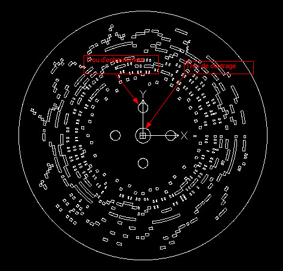

#APrint Studio - 2015

*Patrice Freydiere - Décembre 2014 - Début 2015*

##Introduction

Nous tenons la route vers une release majeure chaque année, pas de révolutions en vue, mais plutot un meilleur logiciel. Cette nouvelle version 2015 contient beaucoup de corrections et d'améliorations sur l'utilisation.

##Nouvelles fonctionnalités

Quelques Points d'amélioration ont été apportés sur cette version 2015 :

- Mise en place de fonctions de montage de cartons
- Amélioration de la lecture MIDI
- Nouveaux scripts / extension pour les Disques carton
- Nouvelle extension pour la reconnaissance de cartons perforés
- Des améliorations sur le moteur sonore

###Montage de carton

Cette fonctionnalité permet de réaliser un montage simple de carton, à partir d'un refrain ou couplet mis dans un fichier midi. Ceci permet, dans une moindre mesure, de pouvoir copier coller des parties de carton, pour répéter un couplet, restructurer l'organisation d'un carton. Une notion de "marqueur" permettant de nommer une partie du carton permet également de mieux se repérer dans le morceau.

Cette fonction apparait dans un panneau latéral dans l'écran "carton" 

[une documentation associée est disponible ici](Montage_Cartons.pdf)

###Amélioration de la lecture midi

certains utilisateurs ont rencontrés des difficultés pour lire un fichier midi lorsque les notes se touchent. Nous avons améliorer la lecture pour éviter ces écueils.

Dans les modifications apportée: 

- le classement des évènements midi, pour la lecture, en effet certains morceaux midi ont des notes qui se touchent, l'ancien algorithme dans ce cas ne terminait pas les notes avant de débuter la nouvelle note. 
- Lors de l'export midi, certains trous pouvaient avoir une longueur de "0", ces notes sont maintenant exclues dans l'export.

###Meilleure prise en charge des Disques cartons

une avancée significative cette année est la prise en charge de disques de cartons, pour la numérisation à partir d'une photo, ansi qu'en export (fichier DXF, pouvant être percé avec une machine numérique, ou de façon manuelle).

- un script ajouté au logiciel permet la création d'un fichier vectoriel associé à l'impression du disque.

##Bug Fixs et améliorations ponctuelles

Usuellement, des corrections, améliorations ergonomiques et d'utilisation.
référez vous à la feuille de route pour connaitre les bugs corrigés.

[Bug Tracker](http://www.barrel-organ-discovery.org/flyspray/)

Autres Améliorations :

- Drag and drop de fichiers depuis Internet, il est maintenant possible alors de glisser / déposer des instruments, depuis une fenetre de navigateur.