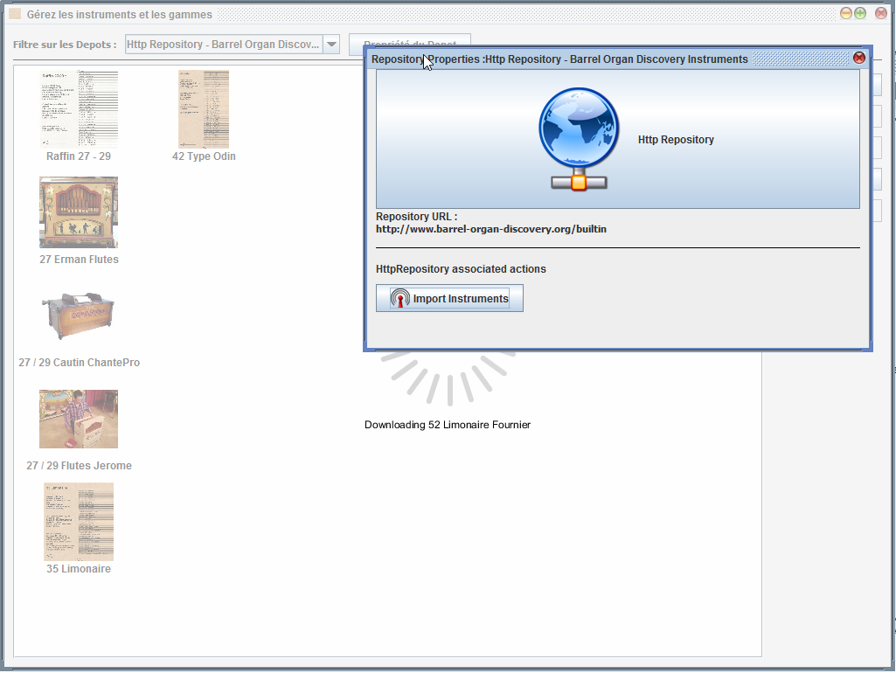
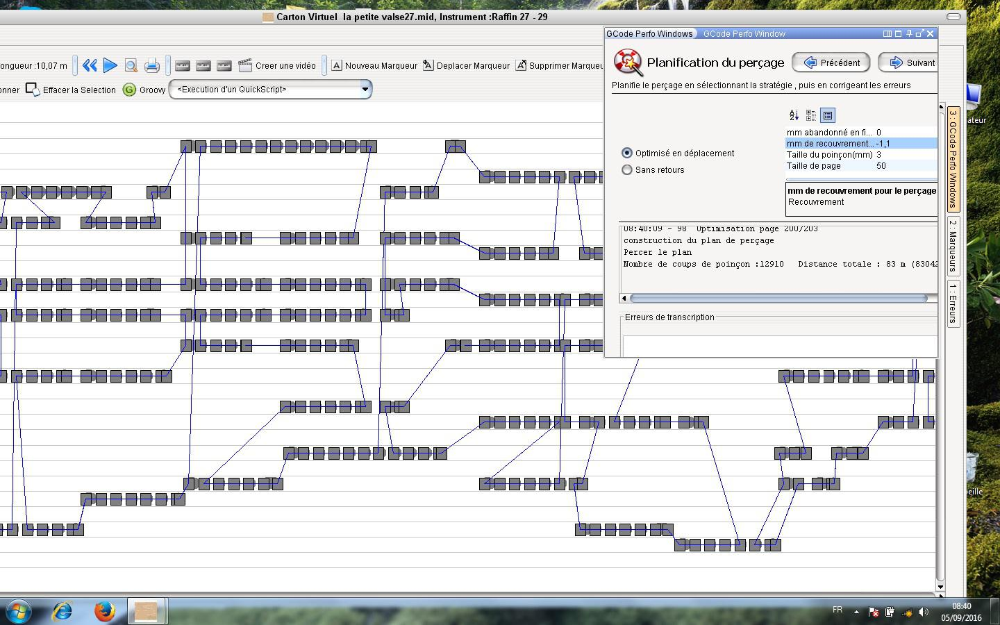

#APrint Studio - 2016

*Patrice Freydiere - Octobre 2016*

##Introduction

Cette Version majeure 2016 introduit les fonctionnalités et développements réalisés cette année 2016 ainsi que des évolutions de développement initiés en 2015.

APrint Studio 2016 avance sur la partie diffusion et pilotage de machine spécialisées pour la perforation de cartons.

Cette nouvelle version doit beaucoup à Jean Pierre Rosset et Freddy Meyer, qui sont les papa du pilotage des machines numériques, intégré dans cette version.

##Nouvelles fonctionnalités

Perçage automatique de cartons directement à partir du logiciel, cette partie est directement attribuée à Jean Pierre Rosset qui a développé une nouvelle technologie de pilotage de machine à perforation de cartons, en utilisant une interface de Commande Numérique (CNC), basée sur GRBL. 

Ce Pilotage en commande numérique apporte :

- Une fluidité de déplacement (gestion des micropas ainsi que des accélérations)
- Un pilotage normalisé avec d'autres logiciels, en effet la machine peut être pilotée par d'autres logiciels qui respectent la norme GCODE. 

Un effort significatif a été réalisé par Jean Pierre et Freddy Meyer pour documenter et simplifier l'utilisation de la commande de perçage directement depuis APrint Studio.

Quelques points d'amélioration ont été également apportés sur cette version 2016 :

- Ajout de chiffres après la virgule pour la définition des instruments et des gammes
- Percussions en français dans l'édition d'instrument, avec le code midi associé (facilite la définition des percussions)
- Nouvelle façon de récupérer les instruments

## Nouveau type de dépôt d'instruments

Suite à l'arrêt de certains services de Google, nous avons retravaillé l'accès aux instruments via internet.

Le gestionnaire d'instruments d'APrint propose maintenant la récupération d'instruments à partir d'une adresse internet. 

La proposition d'instruments est maintenant accessible à un amateur éclairé qui ayant créé des instruments, peut les proposer directement aux utilisateurs via une adresse internet. 

En utilisant un site web externe et un fichier "instruments.xml",  il est donc possible maintenant de créer des dépôts d'instruments spécifiques:

- Limonaires
- Odin
- Instruments de rue
- Instruments de foire
- ..... 

La proposition d'instruments peut également être proposée avec une approche historique. 

## Perforation de cartons 

Cette fonctionnalité , installée à la demande dans la version 2016, permet de préparer la perforation de cartons en prévisualisant le chemin de perforation et les trous à perforer.

La stratégie de perçage peut être choisie, paramétrée et affichée. APrint Studio permet alors dans ces phases de modifier le carton de façon interactive pour ajuster les problèmes de perçage.

Deux stratégies de perçage sont disponibles :

- Sans retours
- Optimisé en déplacement

Ces deux stratégies peuvent être utilisées pour des instruments pneumatiques ou mécaniques.

L'ajout de ponts pour le perçage pneumatique est également possible, avec une taille de pont reglable en fonction des instruments.

### Stratégie : sans retours

Cette stratégie de perçage permet de ne pas faire reculer le poinçon pour des perforations papier ou des perforatrices ne supportant pas le recul du carton ou papier (pour des problematiques de glissements ou de précision)

### Stratégie : Optimisé en déplacement

L'optimisation en déplacement est un algorithme informatique permettant de choisir l'ordre de perçage des coups de poinçon pour limiter les déplacements. Un résumé propose d'afficher le gain de déplacement du carton. 

Des gains de déplacement d'un facteur 5 à 10 sont observés (réduisant considérablement le temps de perçage).

La taille de la page d'optimisation est également réglable, permettant de limiter les déplacements arrière du poinçon et maintenir une précision de perforation.

## Pilotage de la perforation à partir d'APrint Studio

Une fois le perçage réglé, il est possible de perforer le carton dans APrint.

Les phases de réglage sont également prévues dans le logiciel pour permettre une reprise après problème.

Une documentation complète de l'utilisation de l'extension de perçage est disponible dans la section dédiée, créée sur le site WEB [Section sur les perforatrices](../../../../krunch.html)

