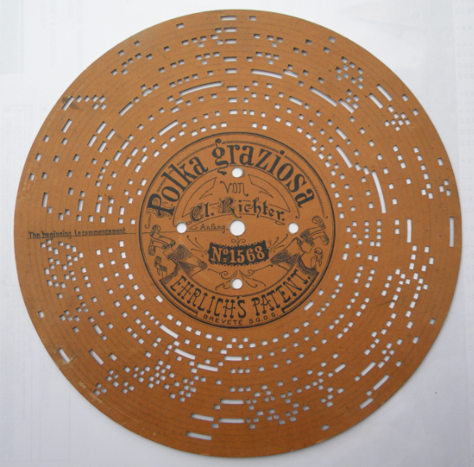
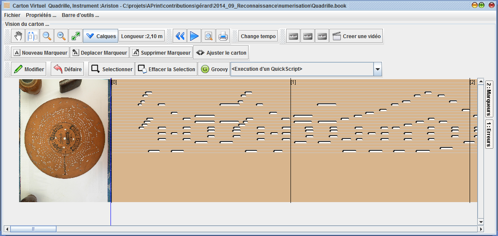
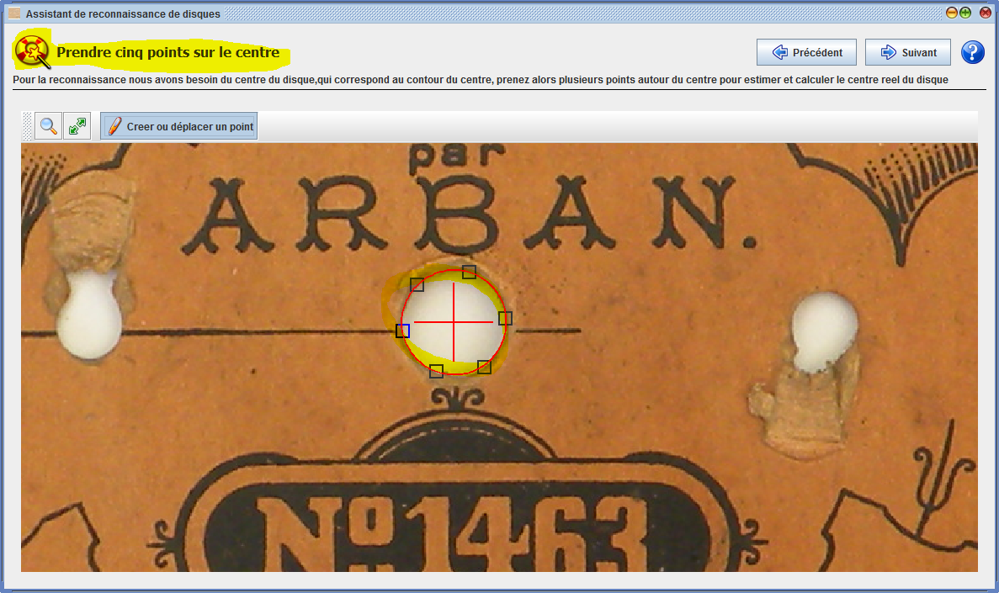
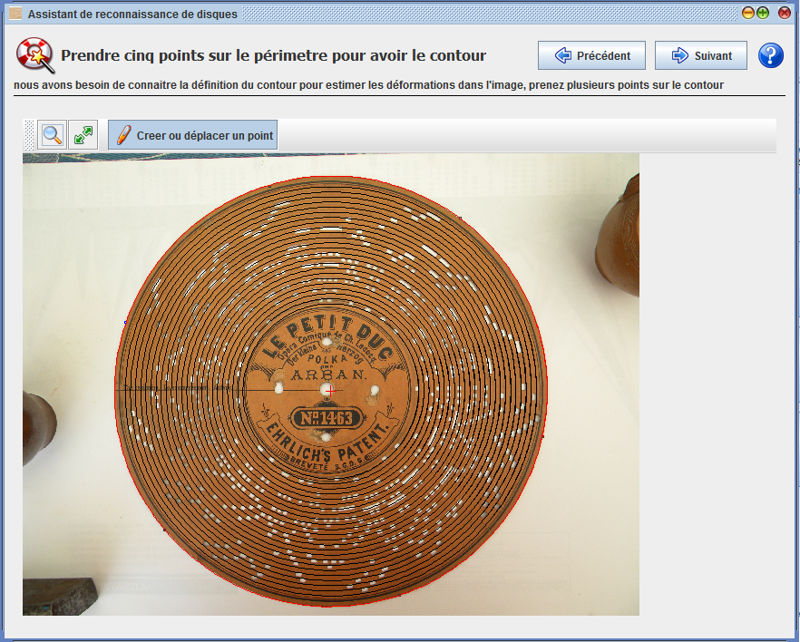
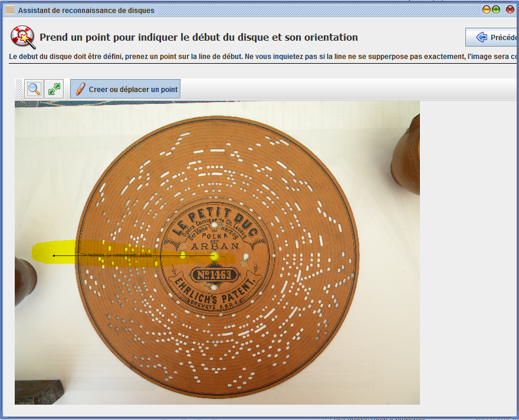
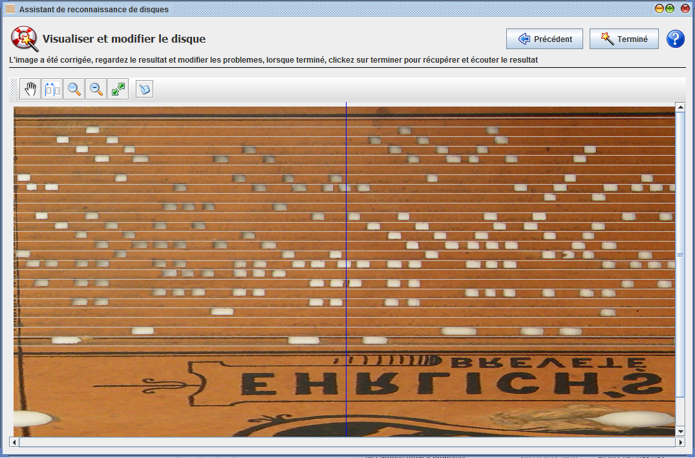

#Reconnaissance de disques carton
---

_Patrice Freydiere_ 
_Novembre 2014_  

**Cette fonctionnalité est utilisable à partir de la version 2014.11 d'APrint Studio**

Cette extension, intégrée au logiciel APrint Studio,  permet la récupération sous forme numérique d'un disque carton (Ariston, Herophon ..) à partir d'une photographie.

L'utilisation peut être diverse :

- Restoration d'un disque endommagé
- Réarrangement pour un autre instrument
- Ecoute du disque lorsque l'on a pas l'instrument

Le resultat obtenu est un carton virtuel sous forme de "carton", réutilisable ou exportable en MIDI. 

Il est possible de créer au final, une sortie vectorielle pour impression ou découpe. En réutilisant la fonctionnalité d'export DXF, format généralement utilisé pour les machines LAZER.

[Une démonstration d'utilisation est accessible ici](https://www.youtube.com/watch?v=ue2M6RD_gAs)

*Exemple de photographie utilisée pour une reconnaissance de disque :*

*Resultat obtenu dans la vue carton du logiciel APrint Studio :*

 

##Démarche

Pour obtenir ce resultat deux étapes sont nécessaires, la première est une étape de définition de l'instrument et de sa gamme. Certains instruments sont déjà définis et récupérables directement sur le site WEB [http://www.barrel-organ-discovery.org/instruments](http://www.barrel-organ-discovery.org/instruments). Si ce n'est pas le cas, APrint Studio permet l'ajout ou la redéfinition d'un nouvel instrument.  Nous fournissons des exemple de définition d'instrument.

La seconde étape est d'utiliser l'assistant de reconnaissance pour numériser le carton, présentée ci dessous.

##Utilisation de l'assistant

L'assistant propose plusieures étapes :

1. la définition du centre du disque
2. la définition du contour du disque
3. la définition du début du disque
4. la numérisation des trous du disque

###Définition du centre du disque

Cette étape permet aau logiciel de localiser le centre du disque. La bonne connaissance du centre du disque permet de redresser ou corriger les déformations du carton, ou de la prise de vue. 

Le point important de cette étape est la connaissance du centre du disque, des outils permettent alors de prendre une serie de points sur une ellipse (qui peut être le trou de centrage ou une gravure sur le carton). Les points saisis permettent de calculer le centre d'une ellipse. Un minimum de 5 points est attendu, mais il est possible pour avoir plus de précision d'en saisir plus.

###Définition du contour du disque

La seconde étape de l'assistant demande à préciser le contour du disque. Ceci est réalisé de la même façon que l'étape précédente, c'est à dire en saisissant une serie de points sur le contour du disque.
Il se peut que la photo soit déformée et ne permette pas directement de pouvoir correctement lire les trous (mal qualifiés). La connaissance du contour permet ainsi de mieux prendre en compte les déformations et redresser au mieux la photo pour la mettre à plat.

###Définition du début du disque

Cette nouvelle étape demande à définir le debut du carton (emplacement où le disque commence sa lecture). La saisie d'un seul point est nécessaire sur le contour, comme indiqué sur la photo en jaune.

###Numérisation du disque

Les étapes précédentes on permis de prendre connaissance de la geometrie du carton, de la gamme et ses différents paramètre. Le disque est alors "déroulé" pour permettre une saisie à la façon "Carton".

Cette étape permet la numerisation des trous au dessus de la photo. 

On retrouve ici dans l'écran, l'ensemble des outils principaux de manipulation du carton, avec l'outil permettant la définition d'un trou, ou sa suppression.

L'étape peut etre réalisée manuellement, ou vous pouvez utiliser un bouton de reconnaissance automatique, utilisant un algorithme qui donne de bons resultats pour une première reconnaissance. La reconnaissance automatique peut être complétée par une série d'étapes manuelles avec les outils si certains trous ont été manqués ou doivent être complétés, ou même réduits (car trop grands).

###Terminer l'assistant

La fin de l'assistant importe dans APrint Studio le contenu du disque dans une fenetre carton, permettant sa sauvegarde, son export en fichier MIDI. Référez vous alors à la documentation et aux tutoriaux pour plus d'informations.

_le resultat obtenu:_

