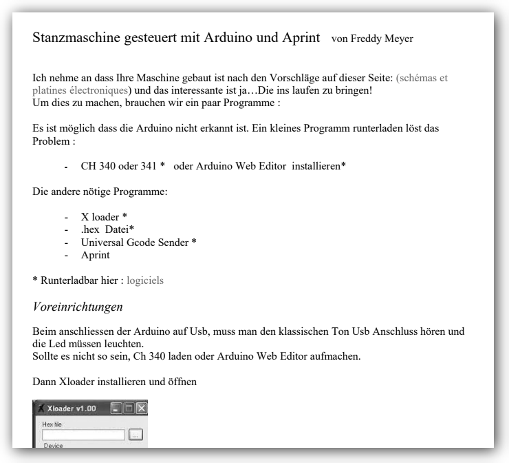

# Documents associés à la mise en place d'une perforatrice

Vous trouverez ici, l'ensemble des documents consolidés de la construction de machines à perforer réalisées par Jean Pierre Rosset et Freddy Meyer. C'est un ensemble de documents qui vous permettra de vous inspirer ou d'utiliser les éléments pour votre propre besoin.

## La Machine

[La mécanique de la machine de Jean Pierre](mecanique/jeanpierre/2emeproto.md)

[Video de présentation des éléments mécaniques](https://www.youtube.com/watch?v=4iaGYADh8EE)

[L'électronique de la machine](electronique/electronique.md)

## Paramétrage

[Article sur le Paramétrage Logiciel pour la machine](logiciel/parametrage_machine.md)

## Utilisation

[Article sur l'utilisation d'APrint Studio pour la perforation](logiciel/utilisation_perforatrice.md)

## Eléments techniques

[Mesure de performances de la machine, paramétrage](miseaupoint/mesures.md)

## Traduction de construction et mise en œuvre en Allemand, proposé par Freddy Meyer

[Laden Sie das Dokument herunter](Stanzmaschine gesteuert durch Arduino und Aprint par Freddy Meyer.doc)