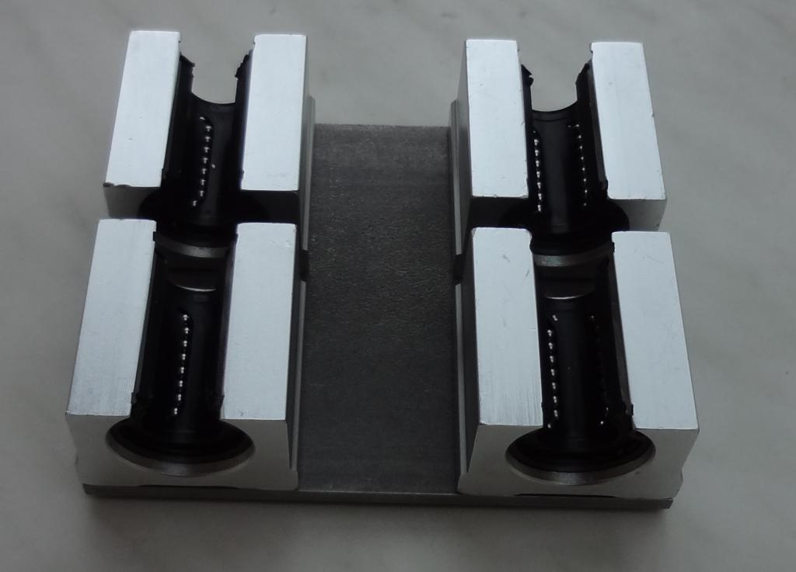

#Mecanique de la 2eme Machine de Jean Pierre

Jean Pierre Rosset - 2016

Dans cette rubrique, je vais présenter mon 2ème prototype. Il a une course légèrement augmentée et équipé d'une fourche différente et munie d'un poinçon carré.
Je vais successivement amener les images au fur et à mesure de sa construction.

##Structure

Le fait de reposer les axes sur 2 plaques de base séparées permet de tendre la courroie simplement en dévissant le serrage des supports et en éloignant les 2 plaques et en revissant. 

Voici l'arrivée de l'axe Y (avance carton). Ce dispositif sera rehaussé par de colonnettes à la hauteur de la matrice de poinçonnage :

Avec les colonnettes et le rouleau entraîneur :

##Installation des Moteurs + Electronique

Voici avec les entraînements et les fins de course installés :

Les deux capteurs de fin de course sont des fourches optiques qui détectent les fins de course. Le HOMING (commande $H) du Grbl détecte la fin de course et la fourche de perforation avance et recule à très petite vitesse et s'arrête pile poil et toujours à la référence machine comme pour une CNC (essai au comparateur !).

Depuis cette référence, une commande simple (offset) paramétrée une fois pour toute, déplace le poinçon à la référence du carton et ainsi les ordres de la perforation peuvent être envoyés.

la matrice est réalisée dans un morceau d'acier HSS.
c'est usiné par électro-érosion. Le fil fait à peu près 0,2 mm de diamètre et pour ne pas avoir d'arrondi dans les coins, le fil rentre un petit peu dans l'angle pour supprimer l'arrondi.
Pour le poinçon, j'ai acheté chez RC-machines des barreaux en HSS et de 3x3 mm de section.

Avec le chemin du carton

Voici les images avec le câblage et sur la fourche les deux renforts :

##Chemin de carton

Le chemin de carton :

Le plan incliné en bois est introduit dans le tube de la fourche et est maintenu par des aimants. Le dispositif en tôle est placé sous la fourche et est maintenu par des aimants.
Le récipient est glissé sous la fourche et est aussi maintenu par un aimant.

##Performances de la machine

**10 août 2016** : Voici les informations de perforation :

3,2 mètres de carton perforés en 15 minutes 34 secondes et 7498 trous.

donc 934 secondes / 7498 = 0,1245 s par trou

(3,2 / 934) x 3600 = 12,33 m par heure (estimation pour cette densité de trous).

J'ai donc perforé avec les réducteurs de débit sur le vérin.

Sur la sortie du compresseur j'ai ajouté un décanteur de condensation :

