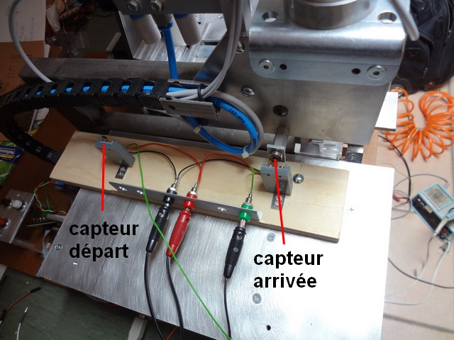
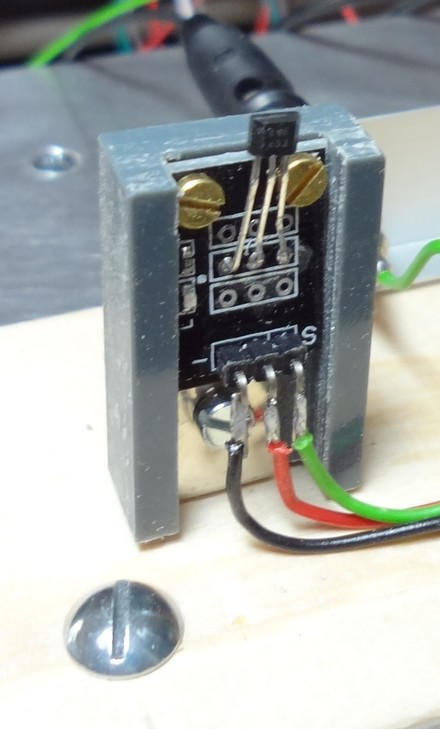
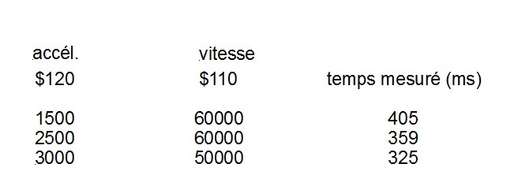
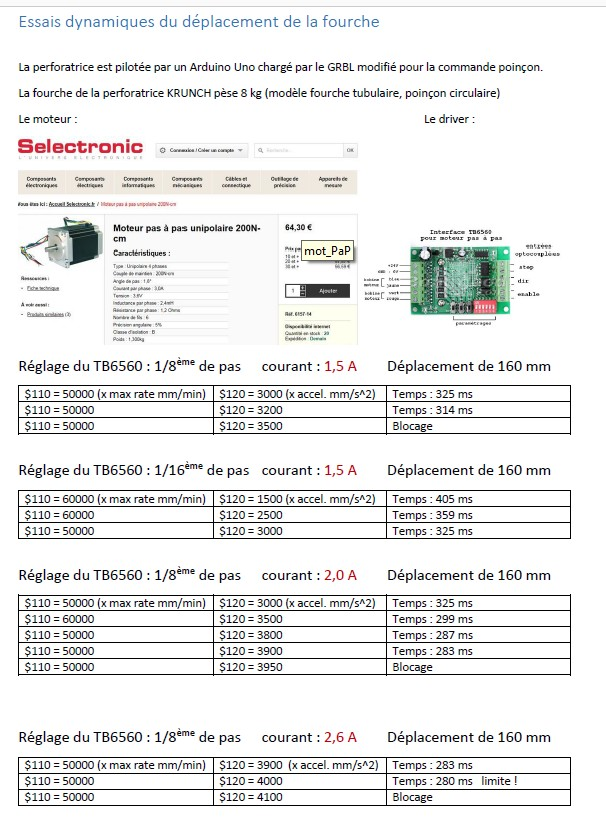

#Mesure de vitesse Perfo Jean Pierre

L'axe X est formé d'un rectangle et est de ce fait pas sujet à flexion.
Pour revenir aux performances de ma perforatrice "KRUNCH", j'ai réalisé un chronomètre (un 2ème Arduino").
Ce chronomètre est déclenché par 2 capteur Hall : le START et le STOP. 
Ces 2 capteurs sont placé pour évaluer les déplacements et j'ai choisi 160 mm.

Un aimant est fixé sur la fourche au moyen d'une entretoise.
La fourche de ma perforatrice équipée du distributeur et du vérin pneumatique pèse 8 kg.
Mon "driver" de moteur est réglé pour 1/16ème de pas.
Le logiciel GRBL est paramétré avec différentes valeurs pour évaluer les limites en vitesse:

Les paramètres sensibles sont l'accélération et la vitesse.
Voici quelques mesures de mes essais (pour 160 mm de course) :

Unités des paramètres du GRBL : $110 xmax rate, mm/min
$120 x accel, mm/sec^2

Une accélération plus grande (4000) n'est pas possible, le moteur bloque.

Quelques précisions : lors des mesures, j'ai omis d'indiquer le paramétrage du courant (il était paramétré à 1,5 A)
J'ai donc repris ces mesures et indiqué les différents points qui modifient les mesures : 

