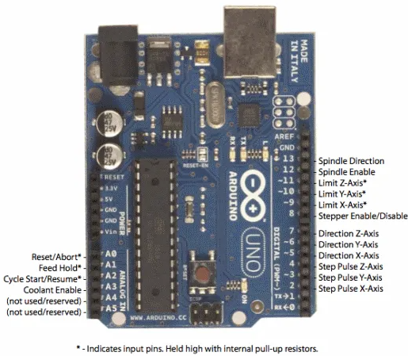
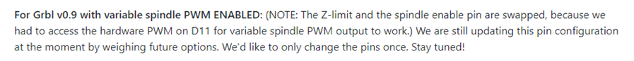
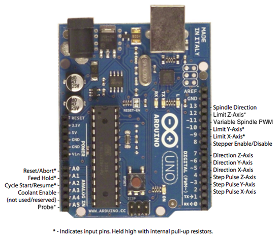
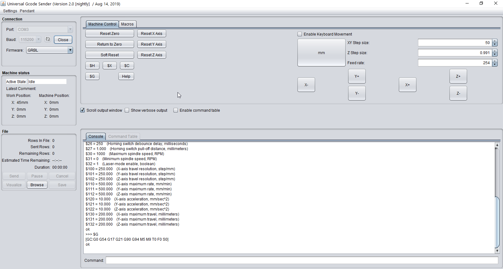
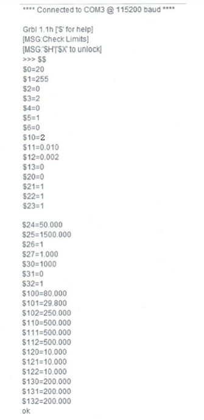

# DOCUMENT GRBL ET INITIALISATION POUR COMMANDER KRUNCH LASER

Par Jean Pierre Rosset

Pour utiliser une machine Laser avec un Arduino ou d'autres microcontrolleurs, **la version 1.1 de GRBL est nécessaire**. 

**ATTENTION :** Pour les version Perfo (avec Poinçons), l'ancienne version 0.9 Ajustée pour intégrer le M100 est nécessaire, vous trouverez plus d'information sur [cette version spécifique à cette URL](https://github.com/barrelorgandiscovery/grblPunch). et des [informations complementaires de mise en oeuvre sont accessibles à cette URL](http://www.barrel-organ-discovery.org/site/krunch.html). [Avec l'ensemble des logiciels ici](http://www.barrel-organ-discovery.org/site/download.html)

Dans L'utilisation Laser, ATTENTION, GRBL A Changé le câblage et le rôle des PINS

**L’ancienne version de GRBL (0.8-0.9) l'attribution des pins est la suivante :**

**DANS la Nouvelle version de GRBL l’attribution diffère au niveau des pins 11 et 12 :**

# **Comment obtenir un GRBL 1.1 adapté pour la commande des perforatrices Laser :**

Pour que la commande $H puisse être active et ainsi réaliser le Homing uniquement sur l’axe X, c’est-à dire la mise au « zéro mécanique » de la machine, il faut un GRBL 1.1 adapté. En effet le GRBL 1.1 usuel téléchargé depuis internet, est souvent compilé pour réaliser le Homing sur les 3 axes X, Y et Z.

Pour les perforatrices, il faut réaliser le Homing que sur l’axe X (position 0 de la tête laser).

### 1 - Télécharger le code source GRBL et l’adapter

Télécharger le fichier ZIP depuis https://github.com/grbl/grbl, bouton « Code » et « Download ZIP ». Décompresser le fichier.

C’est avant la compilation du fichier initial qu’il faut adapter le fichier grbl/grbl/config.h.

Là où le fichier définit les variables de compilation HOMING_CYCLE_0/1/2, remplacer toutes les définitions par :

\#define HOMING_CYCLE_0 (1<<X_AXIS)

et pas de HOMING_CYCLE_1 ou HOMING_CYCLE_2.

(ceci vient du commentaire https://github.com/grbl/grbl/issues/1440)

### 2 - Inclure la librairie GRBL modifiée dans Arduino IDE

Tout d’abord, supprimer les anciennes versions de GRBL dans Ardunio IDE (dossier Documents/Arduino/libraries).

Ensuite, importer le dossier grbl/grbl comme librairie dans Arduino IDE (Menu Croquis / Inclure une bibliothèque / Ajouter la bibliothèque ZIP), et sélectionner le dossier grbl/grbl (même si ce n’est pas à proprement parler un fichier ZIP ! cela fonctionne – le ZIP que nous avons téléchargé n’a pas de config.h adapté).

### 3 - Compiler et téléverser GRBL

Ouvrir le croquis grblUpload dans le dossier grbl/grbl/examples.

Menu Croquis / Téléverser.

### 4 - Exporter le fichier HEX

Pour distribuer cette version de GRBL, Croquis / Exporter les binaires compilées.

Deux fichiers **.hex** sont créés dans le dossier **grbl/grbl/examples/grblUpload**. La distinction entre les deux fichiers n’est, semble-t-il, pas importante si on utiliser la programmation via USB.

# **Paramétrage GRBL 1.1 sur Arduino :**

Le paramétrage se fait alors que l’Arduino est branché et que vous êtes en liaison série avec lui. 
Il existe beaucoup de logiciels différents permettant d’envoyer le G-Code et de contrôler GRBL. Nous allons paramétrer GRBL le plus simplement du monde avec le logiciel Universal Gcode Sender (UGS), en envoyant manuellement les commandes.

### Connexion à GRBL Arduino en utilisant Universal GCode Sender

**Lancer UniversalGcodeSender** : Attention sélectionner le bon port COM et Baud : 115200 et Ouvrir

Sélectionner Dans « Contrôle Machine » : La liste des paramètres de réglage est donnée par la commande :   $$ et valider au clavier par « ENTER ».

Pour modifier ces paramètres, il faut sélectionner « Commands », dans la fenêtre taper par exemple $100=100 et valider au clavier par « ENTER ».

Si vous refaite $$, la valeur que vous avez mise (100) sera à la ligne $100 changée en $100=100.

Le paramétrage utilisé pour la perfo de Jean Pierre :

#### **Pour calibrer ou modifier :**

- Le nombre d’impulsions par mm de déplacement en X (fourche) :		 $100
- Le nombre d’impulsions par mm de déplacement en Y (avance carton) :	$101
- La vitesse en déplacement de l’axe X (le laser) :				$110
- L’accélération en déplacement de l’axe X (le laser) :			$120
- La vitesse en déplacement de l’axe Y (avance carton) :			$111
- L’accélération en déplacement de l’axe Y (avance carton) :		$121

#### **Description des fonctions des paramètres :**

| **Settings and sample values** | **Description**                           |
| ------------------------------ | ----------------------------------------- |
| $0=20                          | Step pulse, 			microseconds      |
| $1=255                         | Step idle delay, 			milliseconds |
| $2=0                           | Step port invert, 			mask        |
| $3=2                           | Direction port 			invert, mask   |
| $4=0                           | Step enable invert, 			boolean   |
| $5=1                           | Limit pins invert, 			boolean    |
| $6=0                           | Probe pin invert, 			boolean     |
| $10=7                          | Status report, mask                       |
| $11=0.010                      | Junction deviation, 			mm        |
| $12=0.002                      | Arc tolerance, mm                         |
| $13=0                          | Report inches, 			boolean        |
| $20=0                          | Soft limits, boolean                      |
| $21=1                          | Hard limits, boolean                      |
| $22=1                          | Homing cycle, boolean                     |
| $23=1                          | Homing dir invert, 			mask       |
| $24=50.000                     | Homing feed, mm/min                       |
| $25=1500.000                   | Homing seek, mm/min                       |
| $26=1                          | Homing debounce, 			milliseconds |
| $27=1.000                      | Homing pull-off, mm                       |
| $30=1000.                      | Max spindle speed, 			RPM        |
| $31=0.                         | Min spindle speed, 			RPM        |
| $32=1                          | Laser mode, boolean                       |
| $100=80.000                    | X steps/mm                                |
| $101=29.800                    | Y steps/mm                                |
| $102=250.000                   | Z steps/mm                                |
| $110=500.000                   | X Max rate, mm/min                        |
| $111=500.000                   | Y Max rate, mm/min                        |
| $112=500.000                   | Z Max rate, mm/min                        |
| $120=10.000                    | X Acceleration, 			mm/sec^2      |
| $121=10.000                    | Y Acceleration, 			mm/sec^2      |
| $122=10.000                    | Z Acceleration, 			mm/sec^2      |
| $130=200.000                   | X Max travel, mm                          |
| $131=200.000                   | Y Max travel, mm                          |
| $132=200.000                   | Z Max travel, mm                          |

### **Réglage du décalage entre le homing et le bord de référence du carton**

- Dans « Contrôle Machine » : La machine est mise au « HOMING » par la commande $H disponible par un bouton.
- Pour déplacer le rayon laser (réglé au minimum) sur le bord de référence du carton, il faut générer un « offset » :
- La commande est à faire une seule fois. L’offset reste stocké dans le Arduino même s’il est non alimenté).
- Avec le bouton X+ et en ajustant Step size amener le rayon laser en bordure du carton (bord de référence).
- Dans « Commands » et dans la fenêtre, taper : G10L20P1X0 (l’origine carton est mémorisée dans l’EEPROM).
- Ce paramétrage peut se voir avec la commande : $#
- Puis vous pouvez tester l’autre limite du carton en tapant dans « Commands », dans la fenêtre, G0X130,
  faire au clavier « Enter ». Pour un carton de 130 mm de largeur, la tête laser se déplace et le rayon laser doit être juste sur l’autre bord du carton.

#### Pour utilisation en mode laser dans APrint

S'assurer que le GRBL est bien en mode "Lazer" : Commande $32=1

Configurez le retour d'information $10=2

**Nota**: ce mode de retour, permet à APrint de connaitre les ordres disponibles dans la mémoire de GRBL et de pouvoir alimenter la machine au fur et à mesure. Dans le cas où la machine devient lente, ou se bloque: vérifiez ce paramètre.

[plus d'information à cette adresse (documentation du mode laser GRBL 1.1)](https://github.com/gnea/grbl/wiki/Grbl-v1.1-Laser-Mode)

# Utilisation dans APrint

Une fois le GRBL de configuré, dans la vue carton d'APrint, [vous pouvez suivre cet article, dans la documentation](https://www.barrel-organ-discovery.org/site/doc/2020/product/krunch/perfo_lazer/)

