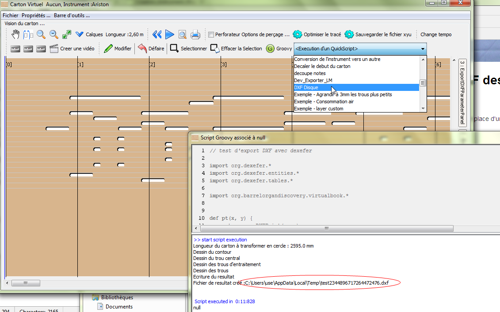
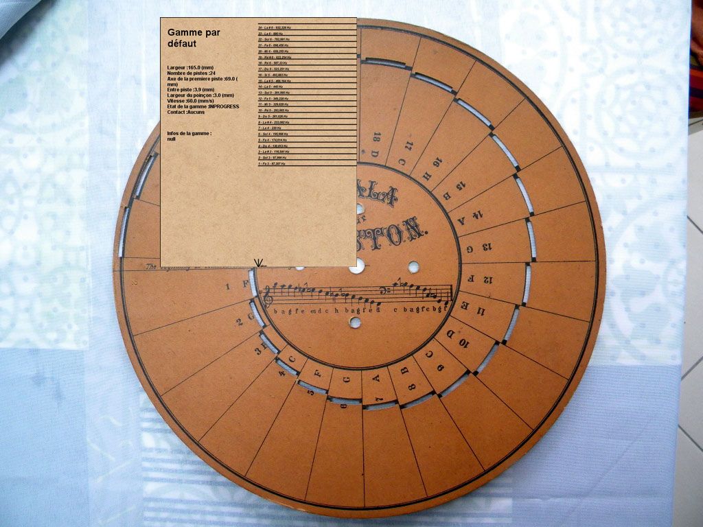
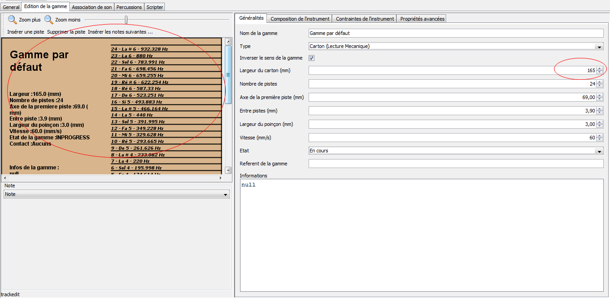
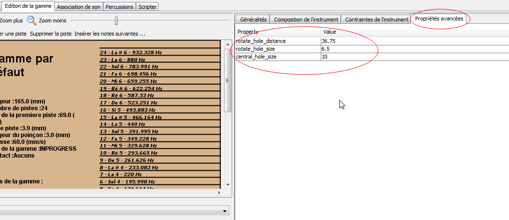
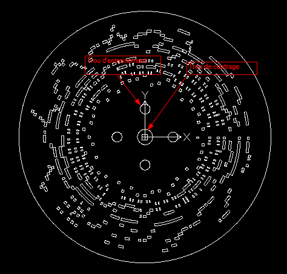

#Création d'instruments dans aprint studio pour des disques

APrint Studio peut être utilisé pour la construction de carton perforés type ariston. La gamme peut être décrite de la même façon, cependant certains paramètres peuvent avoir une signification adaptée par rapport aux disques.

Ces différences sont utilisées par l'outil d'export de disque en DXF.

#Installation du script d'export en DXF des disques

Les étapes doivent être executées scrupuleusement en attendant la mise en place d'une extension.

0. Fermer aprint studio
1. [Recuperez les elements à télécharger pour le faire avec aprint](code_Export_Disque_DXF.zip) 
2. Copier le fichier **dexefer.jar** dans le **répertoire aprintstudio** situé dans le répertoire utilisateur (sur mon poste, cela se situe dans C:\Users\use\aprintstudio car mon login de connexion windows est **use**)
3. Ouvrez aprint studio et faire glisser dans la drop zone,le script __DXF Disque.aprintbookgroovyscript__

L'installation est terminée, 

vous avez alors dans la vision carton, un quick script __DXF Disque__ créant le fichier DXF associé au carton

Le fichier resultat est placé dans le répertoire affiché dans la console

---

#Comment décrire un instrument de type "Disque" utilisable avec le script

##Compléments dans la description de la gamme de l'instrument

La gamme est décrite dans aprint studio par rapport au centre du disque. La référence est alors indiquée en bas, comme ci dessous.

Ainsi : 

1. la référence de la gamme est **placée en bas**
2. La largeur de la gamme indique le **Rayon du disque**

Les autres paramètres restent valables (axe de la 1ere piste, entre piste, largeur du poinçon ...)

dans l'éditeur de gamme, ceci se présente ainsi :

## Autres paramètres associés à la gamme

D'autres paramètres doivent être indiqués dans la gamme pour pouvoir générer l'image DXF du disque. Les gammes peuvent mémoriser des paramètres supplémentaires pouvant être exploitées par des outils spécifiques. 
On indique ici les paramètres supplémentaires

###Parametre central\_hole\_size

ce paramètre indique le **Rayon** du trou central du disque

###Parametre rotate\_hole\_size

ce paramètre indique le **rayon des trous d'entrainement**

###Parametre rotate\_hole\_distance

ce paramètre indique la distance au centre des trous d'entraitement

#Programme associé

	// test d'export DXF avec dexefer
	
	import org.dexefer.*
	import org.dexefer.entities.*
	import org.dexefer.tables.*
	
	import org.barrelorgandiscovery.virtualbook.*
	
	
	def pt(x, y) {
	    return new DXFPoint(x, y)
	}
	
	def line(from, to) {
	    return new Line(from, to)
	}
	
	// mise en place du fichier
	d = new DXFFile()
	d.tables.add(new VPort(pt(0,0), 1))
	
	// calcul de la longueur
	s = virtualbook.scale
	
	longueur = s.timeToMM(virtualbook.length)
	print "Longueur du carton à transformer en cercle : " + longueur + " mm \n"
	
	def arcpt(double angle1, double distanceCenter, double offsetx = 0, double offsety = 0)
	{
	    pt(distanceCenter * Math.cos(angle1) + offsetx, distanceCenter * Math.sin(angle1) + offsety)
	}
	
	
	def drawArc(double angle1, double angle2, double distanceCenter, double x, double y,int nbpt)
	{
	    (1..nbpt).each {
	        double a  = (angle2 - angle1)/nbpt * (it - 1) + angle1;
	        double a2  = (angle2 - angle1)/nbpt * it + angle1;
	        d.entities.add(line(arcpt(a,distanceCenter, x, y),arcpt(a2,distanceCenter, x, y)))
	    }
	}
	
	def drawArc(double angle1, double angle2, double distanceCenter, int nbpt)
	{
	    drawArc( angle1,  angle2,  distanceCenter, 0 , 0, nbpt)
	}
	
	def drawArc(double angle1, double angle2, double distanceCenter)
	{
	    drawArc(angle1,angle2,distanceCenter,10)
	}
	
	def drawHole(Hole h) {
	
	    def c = { l -> s.timeToMM(l)/longueur * 2*Math.PI }
	    def start = c(h.timestamp);
	    def end = c(h.timestamp + h.length);
	    def axe = h.track * s.intertrackHeight + s.firstTrackAxis
	    def axeb =  axe - s.trackWidth / 2.0
	    def axet =  axe + s.trackWidth / 2.0
	    
	    drawArc(start,end,axeb)
	    drawArc(start,end, axet)
	    d.entities.add(line(arcpt(start,axeb),arcpt(start,axet)))
	    d.entities.add(line(arcpt(end,axeb),arcpt(end,axet)))
	    
	}
	
	def readDoubleProperty(String name)
	{
	    def val = s.getProperty(name)
	    if (val == null)
	        throw new Exception("la propriete etendue " + name + " n'a pas été trouvée dans la définition de la gamme de l'instrument");
	
	    double valeur = Double.parseDouble(val)
	    valeur
	}
	
	print "Dessin du contour \n"
	// dessin du contour, on utilise la largeur de la gamme
	// pour la rayon du disque
	drawArc(0,2*Math.PI, s.width, 100)
	
	print "Dessin du trou central \n"
	// dessin du trou central
	def rayontrou = readDoubleProperty("central_hole_size")
	drawArc(0,2*Math.PI, rayontrou, 100)
	
	print "Dessin des trous d'entraitement \n"
	// dessin des trous de centrage
	def tailletrouscentrage = readDoubleProperty("rotate_hole_size")
	def distancecentrale = readDoubleProperty("rotate_hole_distance") 
	
	(0..3).each {
	
	    def angled = it * Math.PI / 2.0
	    drawArc(0, 2*Math.PI, tailletrouscentrage,
	            distancecentrale * Math.cos(angled) , 
	            distancecentrale * Math.sin(angled), 100) 
	           
	}
	
	print "Dessin des trous\n"
	// dessin des trous
	virtualbook.holesCopy.each {
	    drawHole(it)
	}
	
	
	
	// ecriture du resultat
	print "Ecriture du resultat \n"
	
	def f = File.createTempFile("test", ".dxf")
	def fos = new BufferedOutputStream(new FileOutputStream(f))
	d.write(fos)
	fos.close()
	
	print "Fichier de resultat créé :" + f.absolutePath + "\n"
	
