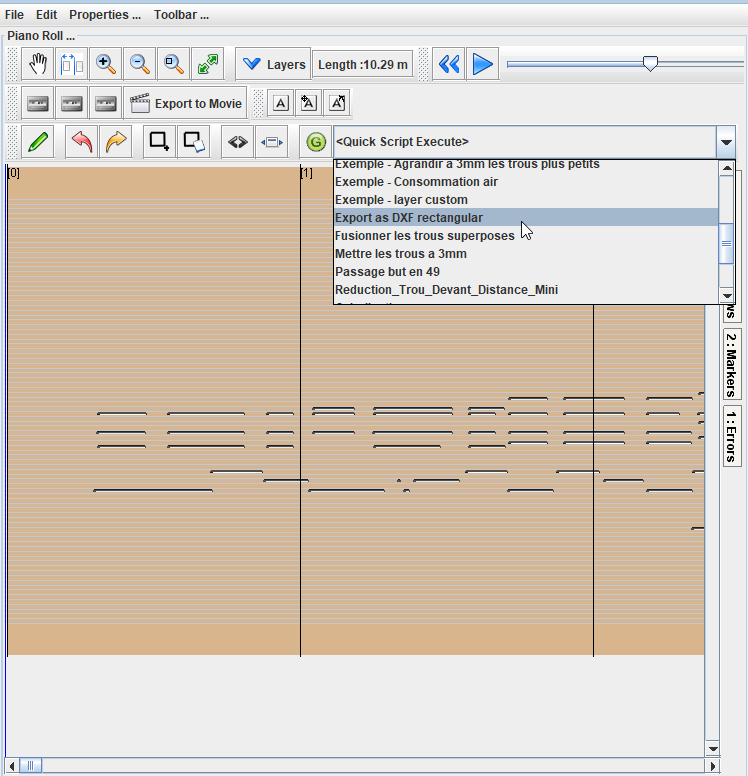
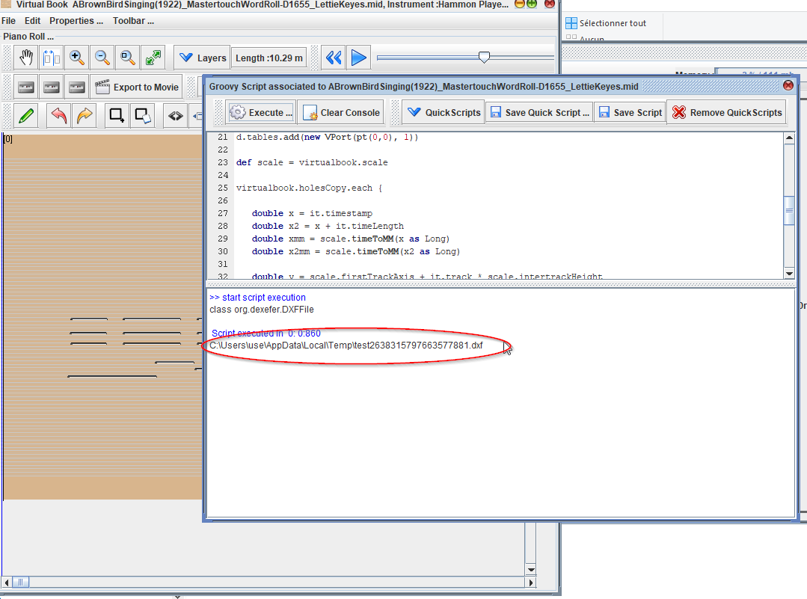
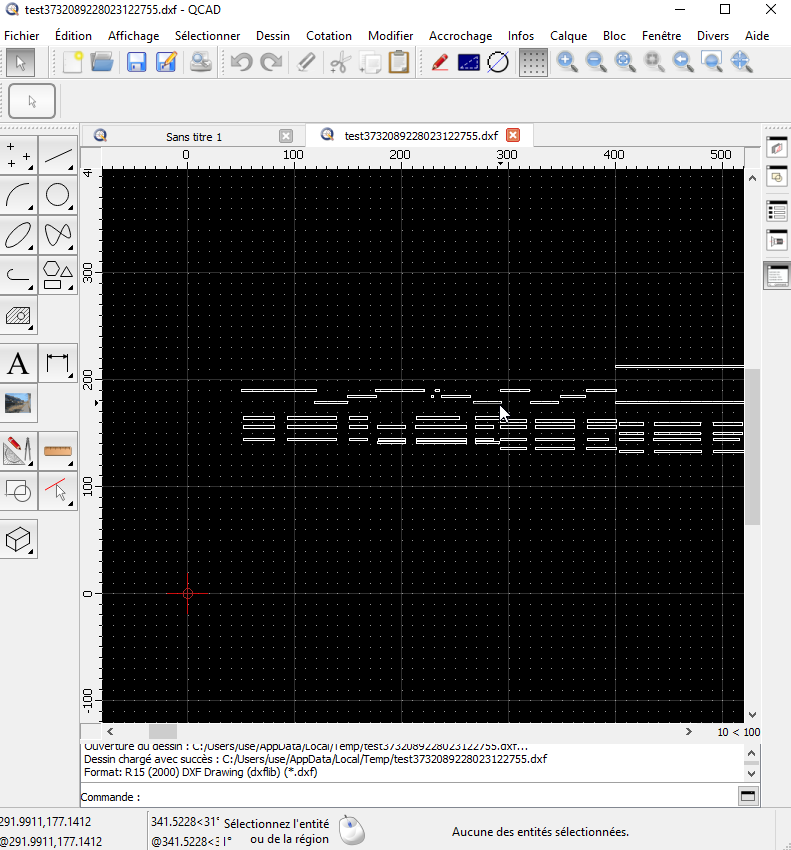

# Export DXF pour les cartons / ou piano rolls

Patrice Freydiere - septembre 2018


Un petit script suffit pour pouvoir réaliser un export en DXF et permettre de faire des découpages à la machine.

Le script présenté ci dessous, nécessite la bibliothèque dexefer.jar. Si vous n'avez pas déjà mis cette bibliothèque , vous pouvez copier le fichier dans le répertoire **c:\users\[profile]\aprintstudio** 

[Telechargement du script et de la bibliothèque](dxf_scripts.zip)

Le script prends la liste des trous, converti les trous en mm, puis ajoute 4 lignes dans le fichier DXF

Le script s'utilise ainsi :

Sélectionnez le script d'export 



La console vous affichera alors l'emplacement du fichier :



Le fichier DXF peut alors etre utilisé dans un logiciel CAD :




## Le Script

Le script est assez simple, et peut être ajusté ou adapté en fonction des besoins


```
// test d'export DXF avec dexefer

import org.dexefer.*
import org.dexefer.entities.*
import org.dexefer.tables.*

// test the existence of dexefer.jar file in ~/aprintstudio folder
print org.dexefer.DXFFile.class


def pt(x, y) {
    return new DXFPoint(x, y)
}

def line(from, to) {
    return new Line(from, to)
}


def d = new DXFFile()
d.tables.add(new VPort(pt(0,0), 1))

def scale = virtualbook.scale

virtualbook.holesCopy.each {

   double x = it.timestamp
   double x2 = x + it.timeLength
   double xmm = scale.timeToMM(x as Long)
   double x2mm = scale.timeToMM(x2 as Long)

   double y = scale.firstTrackAxis + it.track * scale.intertrackHeight
   double h = scale.trackWidth

   d.entities.add(line(pt(xmm,y-h/2),pt(x2mm,y-h/2)))
   d.entities.add(line(pt(x2mm,y-h/2),pt(x2mm,y+h/2)))   
   d.entities.add(line(pt(x2mm,y+h/2),pt(xmm,y+h/2)))   
   d.entities.add(line(pt(xmm,y+h/2),pt(xmm,y-h/2)))

}

def f = File.createTempFile("test", ".dxf")
def fos = new FileOutputStream(f)
d.write(fos)
fos.close()

f.absolutePath

```

