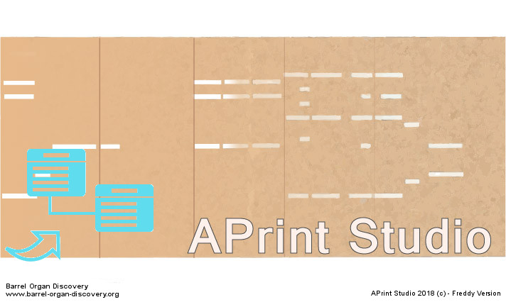
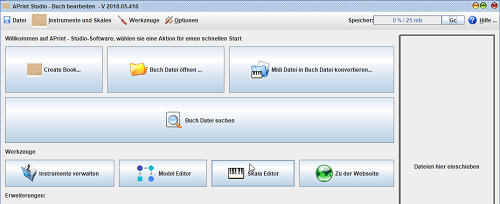
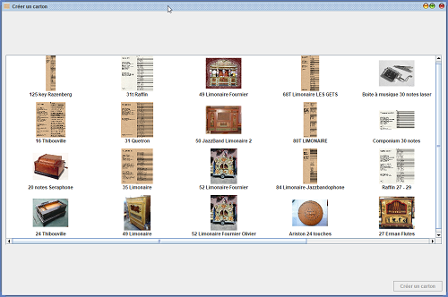
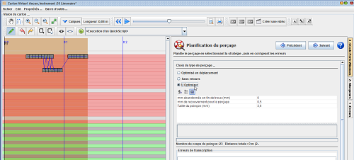
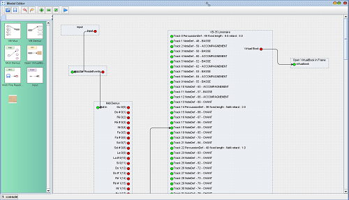

# APrint Studio - 2018 - "Freddy version"

*Patrice Freydiere - Juin 2018*

## Introduction

2018 annonce une maturité sur un ensemble de fonctionnalités ainsi que quelques nouveautés intéressantes en cours d'évolution. Nous innovons toujours autour, ainsi cette version propose une première implémentation du model editor.

Les évolutions et améliorations ont été beaucoup travaillées par Freddy, notamment sur la partie perforation, traduction en allemand et retours sur l'utilisation. Ainsi nos amis germains pourront utiliser cette version dans leur langue maternelle. 

## Traduction en Allemand

APrint Studio 2018 spricht deutsch

 

## Création de carton vierge.

Il manquait une fonction simple de création d'un carton vierge. Bien qu' APrint Studio propose des fonctionnalités de conversion en carton d'orgue et que le point de départ est généralement un arrangement (donc un fichier MIDI), la création d'un carton vierge est intéressante pour plusieurs usages :

- La création d'une gamme d'essai
- un copier coller de notes à partir d'un autre carton, 
- des expérimentations simples

Cette fonction accessible à partir du menu principal propose le choix d'un instrument, avec sa gamme associée.

## Perforation de cartons

### Nouveaux types de commande pour les machines

Des améliorations ont été conduites sur la perforation de carton, d'autres types de commandes sont maintenant supportées par le logiciel :

- Commande de moteur pas à pas pour le poinçon
- Commande électrique avec un seul capteur situé en haut.

Ces nouvelles possibilités sont accessibles dans la nouvelle version du middleware GRBL Punch. 

### Nouvelle stratégie de perforation

Demandée par les utilisateurs cette stratégie propose une perforation en U, sans retours pour le carton ou le papier. Ce type de stratégie de perçage, bien que gourmande en déplacement de machine, permet d'utiliser le logiciel sur du matériel :

- ayant des rattrapages de jeu importants 
- ou ne permettant pas les retours lors de la perforation

La fenêtre de pilotage de la perforation se voit maintenant dotée d'un bouton de réinitialisation de la communication. Ainsi lorsque la machine ou l'arduino de pilotage ne répond plus, il est possible de le réinitialiser, puis de continuer la perforation.

Nous avons également eu de bons retours d'utilisateurs sur la capacité à **CONTINUER** un carton s'étant interrompu pendant le perçage. La capacité à positionner le poinçon à un endroit permet de pouvoir reprendre la perforation lors d'une interruption ou d'une coupure de courant.

## Transformation visuelle de cartons

Le "Model Editor" est une nouvelle fonctionnalité d'APrint Studio 2018, cette première version évoluera certainement avec les utilisateurs. Fort des difficultés pour effectuer des scripts, (nécessite un apprentissage du langage de script), le "Model Editor" vise à proposer une façon visuelle d'effectuer des transformations sur les cartons, et elles sont nombreuses :

- Changement d'instrument / test d'arrangement
- Lecture de fichiers exotiques
- Passage d'une gamme à une autre
- Changement de tempo, changement de registration, ... 

Une nouvelle section dans l'aide en ligne vous propose une documentation plus précise que cette introduction.

## Aide en ligne

Et toujours une amélioration sur la partie aide en ligne, permettant de simplifier l'utilisation et servant de référence dans compréhension du fonctionnement du logiciel.

## Et toujours de petites améliorations

- Le jeu du morceau maintenant se termine de façon moins abrupte
- Bouton "refaire", pour permettre de revenir à l'état après annulation
- Corrections sur la fermetures des fenêtres
- Meilleures métriques sur le perçage de cartons
