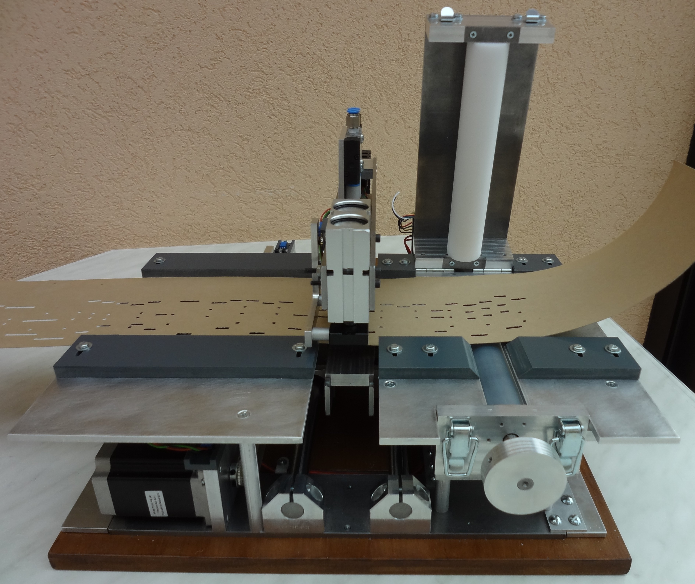
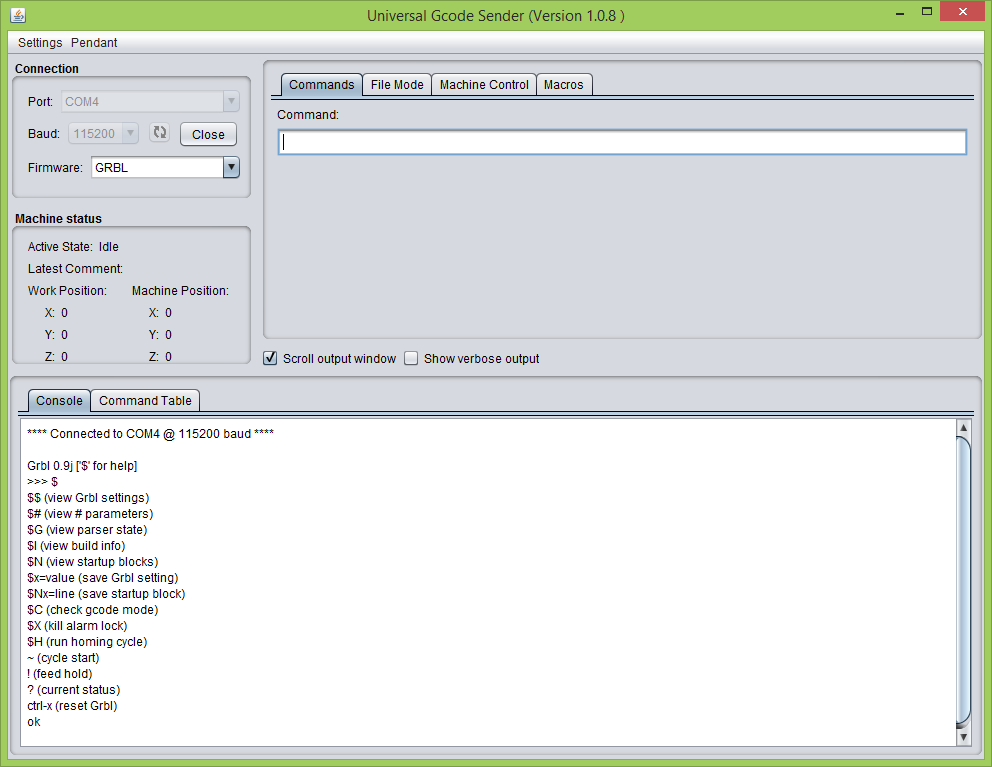
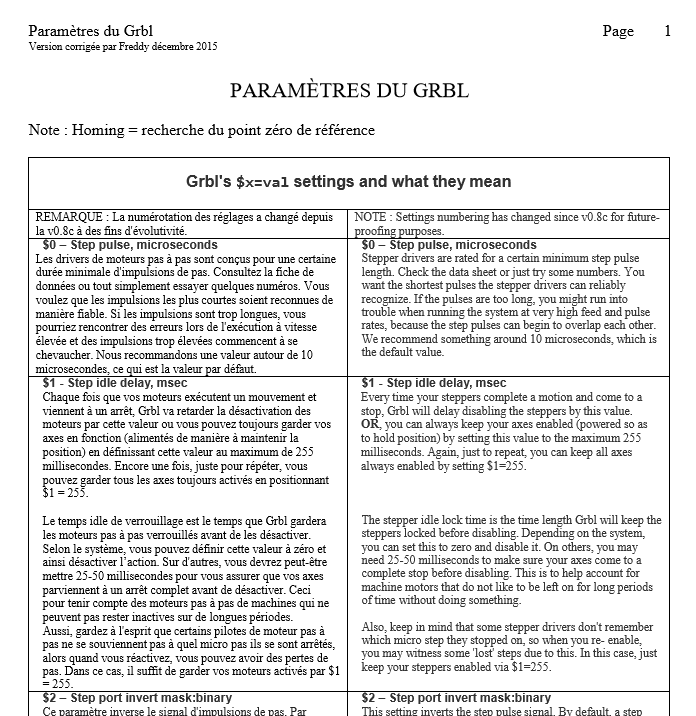

#Pilotage du percage de cartons en utilisant les GCodes (Arduino + GRBL) 

*Juin 2016* - Mise à jour des photos, Ajout d'une documentation de Jean Pierre sur la partie Electronique et Electrique.

*Janvier 2016* - Ajout d'élément sur l'apprentissage de la configuration GRBL par Freddy.

*2015 - 2016* - Article rédigé par Patrice Freydiere, Jean Pierre Rosset

##Introduction 

Cette année 2015 - 2016, Jean Pierre Rosset a réalisé une perforatrice automatique pour carton, en utilisant le meilleure de la technologie actuelle. Fort des projets Open Source Existants, le lien entre la machine outil et l'ordinateur se trouve grandement simplifié, améliorant de fait la fiabilité du pilotage.

Dans les grandes ligne, sa machine , autonome, utilise un arduino pour la gestion des déplacements et problematiques electronique, laissant alors soin à un pilotage CNC utilisant les GCODE. 

Cette approche avait également été évoquée par Pierre Penard lors de discussions. Jean Pierre Rosset l'a fait !

_Principes de la machine :_

La machine est autonome en fonctionnement, l'ordinateur envoie des commandes de déplacement, et de perçage en utilisant une liaison série. Donc plus de perte de pas, et une adaptation simple aux machines existantes. En effet, le paramétrage de l'arduino, permet de positionner une référence, et un certains nombre de paramètres relatifs à la machine. 
L'ordinateur n'a alors plus besoin de connaitre les détails de construction, et de pilotage, en envoyant des commandes génériques comme une machine à commande numérique.

Le projet open source GRBL conçu pour Arduino, implémente un certain nombre de fonctionnalités :

- Gestion des types de commandes
- Gestion des accélérations, déplacements
- Gestion des références (homing)

[Références des pièces utilisées pour la construction de la machine](PIECES_CONSTRUCTION_PERFORATRICE.pdf) 

Indication sur le cablage électrique de la machine de Jean Pierre :

[Cablage de la Partie Electronique et Electrique de la machine](Partie_electrique.pdf)

Vous pouvez contacter les auteurs (Jean Pierre et Freddy) pour avoir des informations plus techniques sur la construction. Beaucoup d'éléments techniques ont été postés sur le forum  [http://orguedebarbarie.vraiforum.com/f7-Les-poinconneuses.htm](http://orguedebarbarie.vraiforum.com/f7-Les-poinconneuses.htm)

##Logiciel spécialisé pour les machines CNC à perforation de carton

Dans le cadre du projet, le logiciel GRBL a été modifié pour les machines à perforation, plusieurs modifications ont été mises en place :

- Mise en place de deux détecteurs pour les états "poinçon haut et poinçon bas"
- Nouvelle commande GCODE M100, permettant de déclencher un coup de poinçon 

le projet dérivé de GRBL - GRBLPunch est disponible et TELECHARGEABLE à cette adresse : [https://github.com/frett27/grblPunch](https://github.com/frett27/grblPunch)

##Mise en place de la partie logicielle de commande par l'arduino

La mise en place passe par plusieurs étapes, 

1 - Récupérer le fichier `grblpunch.hex` dans le projet : [Fichier grblpunch.hex](https://github.com/frett27/grblPunch)

2 - Utiliser le logiciel [XLoader](XLoader.zip) pour charger le fichier dans l'arduino

##Configuration

Une fois le chargement du programme réalisé, l'outil UniversalGCodeSender, permet d'ouvrir une console sur l'arduino afin de pouvoir paramétrer GBRL.

les commandes peuvent être lancées depuis la boite "commande", 

le paramétrage des commandes suit ces indications : [https://github.com/grbl/grbl/wiki/Configuring-Grbl-v0.9](https://github.com/grbl/grbl/wiki/Configuring-Grbl-v0.9)

**Note** : Freddy a réalisé une traduction de l'ensemble des paramètres, (cliquez sur le document pour l'ouvrir)
 

dans notre cas, nous avons paramétré le système en utilisant ces résultats: (résultat de la commande $$)

[Parametres complets de Jean Pierre utilisés en production](Params_15_02_2016.pdf)

#Et le carton alors ???

APrint 2016, intègre une nouvelle fenêtre de création du plan de perçage et génère un fichier GCODE, qui peut être utilisé directement en perçage.

 

