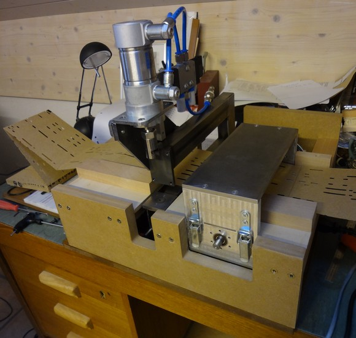
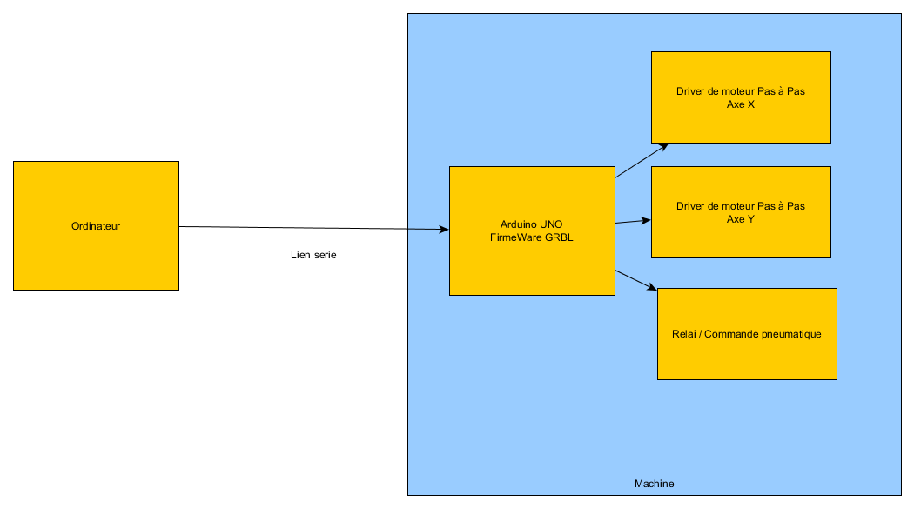
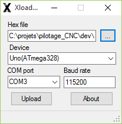

#Pilotage du percage de cartons en utilisant les GCodes (Arduino + GRBL) 

Cette année 2015 - 2016, Jean Pierre Rosset a réalisé une perforatrice automatique pour carton, en utilisant le meilleure de la technologie actuelle. Fort des projets Open Source Existants, le lien entre la machine outil et l'ordinateur se trouve grandement simplifié, améliorant de fait la fiabilité du pilotage.

Dans les grandes ligne, sa machine , autonome, utilise un arduino pour la gestion des déplacements et problematiques electronique, laissant alors soin à un pilotage CNC utilisant les GCODE. 

Cette approche avait également été évoquée par Pierre Penard lors de discussions. Jean Pierre Rosset l'a fait !

_Principes de la machine :_

La machine est autonome en fonctionnement, l'ordinateur envoie des commandes de déplacement, et de perçage en utilisant une liaison série. Donc plus de perte de pas, et une adaptation simple aux machines existantes. En effet, le paramétrage de l'arduino, permet de positionner une référence, et un certains nombre de paramètres relatifs à la machine. 
L'ordinateur n'a alors plus besoin de connaitre les détails de construction, et de pilotage, en envoyant des commandes génériques comme une machine à commande numérique.

Le projet open source GRBL conçu pour Arduino, implémente un certain nombre de fonctionnalités :

- Gestion des types de commandes
- Gestion des accélérations, déplacements
- Gestion des références (homing)

[Références des pièces utilisées pour la construction de la machine](PIECES_POUR_CONSTRUCTION_PERFORATRICE.pdf) 

##Logiciel spécialisé pour les machines CNC à perforation de carton

Dans le cadre du projet, le logiciel GRBL a été modifié pour les machines à perforation, plusieures modifications ont été mise en place :

- mise en place d'un détecteur pour les état poinçons haut et bas
- Nouvelle commande GCODE M100, permettant de déclencher un coup de poinçon 

le projet dérivé de GRBL - GRBLPunch est disponible et TELECHARGEABLE à cette adresse : [https://github.com/frett27/grblPunch](https://github.com/frett27/grblPunch)

##Mise en place de la partie logicielle de commande par l'arduino

La mise en place passe par plusieures étapes, 

1 - récupérer le fichier grblpunch.hex dans le projet : [Fichier grblpunch.hex](https://github.com/frett27/grblPunch)

2 - Utilisez le logiciel [XLoader](XLoader.zip) pour charger le fichier dans l'arduino

##Configuration

Une fois le chargement du programme réalisé, l'outil UniversalGCodeSender, permet d'ouvrir une console sur l'arduino afin de pouvoir paramétrer GBRL.

les commandes peuvent être lancées depuis la boite commande, 

le paramétrage des commandes suit ces indications : [https://github.com/grbl/grbl/wiki/Configuring-Grbl-v0.9](https://github.com/grbl/grbl/wiki/Configuring-Grbl-v0.9)

dans notre cas, nous avons paramétré le système en utilisant ces résultat: (resultat de la commande $$)

	Parametrage associé aux tests réalisés le 17/08/2015

	
	$0=10 (step pulse, usec)
	$1=25 (step idle delay, msec)
	$2=0 (step port invert mask:00000000)
	$3=2 (dir port invert mask:00000010)
	$4=0 (step enable invert, bool)
	$5=0 (limit pins invert, bool)
	$6=0 (probe pin invert, bool)
	$10=3 (status report mask:00000011)
	$11=0.010 (junction deviation, mm)
	$12=0.002 (arc tolerance, mm)
	$13=0 (report inches, bool)
	$20=0 (soft limits, bool)
	$21=1 (hard limits, bool)
	$22=1 (homing cycle, bool)
	$23=1 (homing dir invert mask:00000001)
	$24=25.220 (homing feed, mm/min)
	$25=500.000 (homing seek, mm/min)
	$26=0 (homing debounce, msec)
	$27=1.000 (homing pull-off, mm)
	$100=25.635 (x, step/mm)
	$101=17.000 (y, step/mm)
	$102=250.000 (z, step/mm)
	$110=30000.000 (x max rate, mm/min)
	$111=10000.000 (y max rate, mm/min)
	$112=500.000 (z max rate, mm/min)
	$120=2000.000 (x accel, mm/sec^2)
	$121=2000.000 (y accel, mm/sec^2)
	$122=10.000 (z accel, mm/sec^2)
	$130=200.000 (x max travel, mm)
	$131=200.000 (y max travel, mm)
	$132=200.000 (z max travel, mm)

#Et le carton alors ???

APrint nous permet dans une 1ere étape la génération d'un fichier GCode, pouvant être envoyé sur la machine pour perçage. le script suivant, pouvant être adapté permet l'export des commandes de perforation dans un fichier GCode.

	
	
	import org.barrelorgandiscovery.gui.atrace.*
	import org.barrelorgandiscovery.gui.aedit.*
	import java.awt.*
	import java.awt.geom.* // point2D
	
	def pconverter = new PunchConverter(virtualbook.scale, 3.2, 2) // poincon de 3mm par 3mm
	
	def punchConvertionResult = pconverter.convert(virtualbook.holesCopy)
	// punch convertionResult contient les erreur et la liste des coups de poincons à donner (avec éventuellement un recouvrement)
	
	
	
	println punchConvertionResult.holeerrors
	
	def punches = punchConvertionResult.result
	
	// pour chaque coup de poincons, on ecrit les ordres pour la machine
	
	c = 0
	punches.each {
	   println "N${c++} G90 X${it.y-1.0} Y${it.x}"
	   println "M100"
	}
	
	// visualisation sur le carton des coups de poinçons
	
	// création d'un calque pour visionner le resultat
	def g = new GraphicsLayer("poincon")
	g.setStroke(new BasicStroke(0.4f));
	
	// on recupere la gamme de l'instrument
	def scale = virtualbook.scale
	
	// on enleve des graphiques du calque si necessaire, lorsqu'on lance plusieurs fois le script
	g.clear()
	
	// on ajoute les coup de poinçon au calque pour les visualiser
	// les coordonnes du coup de poincon sont au centre du poincon, il faut prendre en charge
	// le referentiel de position
	
	// scale.trackwidth est la largeur de la piste (en y)
	
	punches.each {
	    g.add(new Rectangle2D.Double(it.x - 2.0,it.y - scale.trackWidth / 2.0, 4.0, scale.trackWidth))
	}
	
	// on ajoute le calque
	pianoroll.addOrReplaceLayer(g)
	// on rafraichit la fenetre
	pianoroll.repaint()

