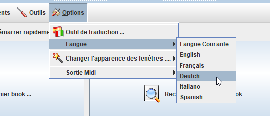
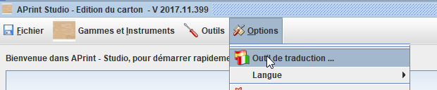
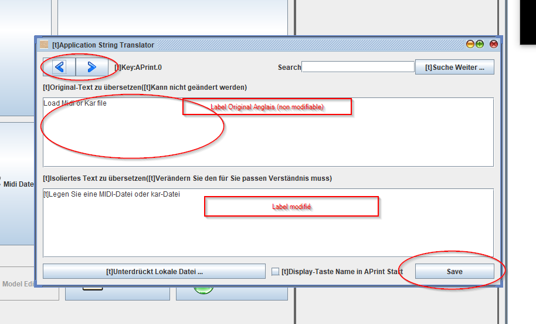

 # Traduire ou corriger la traduction standard

Patrice Freydiere - Janvier 2018

APrint est proposé en standard en anglais et français, une traduction automatique est également proposée dans les autres langues, cependant cette traduction automatique peut ne pas être précise. Et vous pouvez l'améliorer et la changer.

Cette page propose une documentation et une procédure pour utiliser , corriger et améliorer la traduction sur votre propre ordinateur. Vous pouvez également nous transmettre vos fichiers, pour être intégré dans une nouvelle version du logiciel.

Ceci est fait en 3 Etapes :

​	1 - Changer la langue courant (langue pour la traduction)

​	2 - Utiliser l'outil de traduction

​	3 - Redémarrer APrint pour que vos traduction personnelles soient prises en compte et voir le resultat

### Etape 1 :

Passez dans la langue à traduire.

Les traductions sont alors prise en compte dans la langue choisie.

### Etape 2 - Utiliser l'outil de traduction

L'outil de traduction est disponible à partir du menu option de la fenetre principale.

L'outil de traduction d'ouvre alors et propose les fonction suivantes

Les deux flèches permettre de dérouler les différents noms et labels de l'application

Le premier panneau montre le label de référence en anglais, ce panneau n'est pas modifiable, le second panneau permet alors de modifier la traduction du label.

Les traductions modifiées ou réalisée sont sauvegardée en utilisant le bouton "Save". Ce bouton propose l'enregistrement des labels modifiés dans le répertoire **aprintstudio\org\barrelorgandiscovery\messages_[LANG].properties**

### Etape 3 : Redémarrer APrint et voir le resultat

les chaines traduites sont chargées au démarrage de l'application, ainsi s'il y a des modifications, il est nécessaire de redémarrer pour voir le résultat.

### Nous envoyer les traduction

Si vous êtes satisfait des traductions, vous pouvez nous envoyer le fichier .properties associé à vos spécialisation, celles ci permettront à d'autres utilisateur de pouvoir utiliser vos labels, et avoir un confort d'utilisation plus directe.